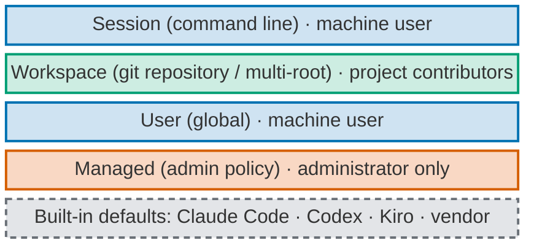
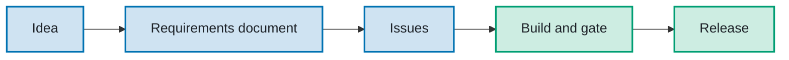

# personal-multi-harness-workstation-configuration

The managed workstation: one versioned source for how every agent harness (Claude Code, Codex and
Kiro) behaves on the owner's devices. One release installs the same protection, standards and working
method into every agent harness, on any of his machines.

This page is the short version. The target behaviour and the reasons for it are in the
[Product Requirements Document](docs/personal-multi-harness-workstation-configuration-product-requirements-document-project.md).
The mission, principles and hard rules for agents working here are in [`AGENTS.md`](AGENTS.md).

## Why it exists

Work done with AI agents must respect other people: clients' and employers' confidential material,
third parties' commercial rights and intellectual property, and everyone's personal data. Only the
owner's own knowledge and learning is his. This repository is the protection layer that keeps that line
for every agent at once, and stops credential reads, irreversible commands and unsafe actions while the
agents run. It is also a rehearsal, on one person's workstations, of what a company would roll out to
its engineers.

The command-line agent harnesses come first: they are fast, tile well, scale to many parallel sessions,
and keep configuration in files that can be versioned, tested in CI and installed by one command.
Running the same behaviour on three agent harnesses protects against any one vendor's cost changes,
feature changes and outages.

## Four layers



*Read bottom-up. Grey dashed: vendor. Orange: administrator only. Blue: machine user. Green: project
contributors.*

- **Managed:** a thin protection core that no agent can switch off, because changing it needs `sudo` and
  `sudo` is denied to agents.
- **User:** the global brief, the owner overlay, interaction standards and the working method (agents,
  skills, commands), rendered into each agent harness's native mechanism.
- **Workspace:** only what one project needs, plus a version key that names the workstation release
  range it expects.
- The `tadeumendonca-skills` plugin is a generated copy of the method, never a source and never a
  protection.

Hard locks are kept for irreversible or third-party harm only. Everything else is taught through
instructions, native settings and automatic cleaning, and reported at its real evidence level.

## Workflow



*Read left to right. Blue: the owner decides. Green: the agents carry the work to the end.*

## Current state

The target above is being delivered in slices tracked under
[#52](https://github.com/tedeuxx/personal-multi-harness-workstation-configuration/issues/52). What the
repository carries today, at its evidence level (*written*, *installed*, *loaded*, *enforced* are four
different claims). The detailed log is in [`AGENTS.md`](AGENTS.md), "Status".

| Control | Evidence level |
| --- | --- |
| Global brief ([ADR-0010](docs/adr/0010-global-brief-rendered-to-each-harness.md)) | Installed for Claude Code, Codex and Kiro. Loaded in Claude Code and Codex (measured headless); Kiro documented. An instruction, never claimed as enforced. |
| Deny floor ([ADR-0016](docs/adr/0016-user-level-deny-floor-rendered-per-harness.md)) | Installed for Claude Code and Codex. Enforced when measured in throwaway homes; not re-measured on the reference machine. A prefix floor: other spellings of a denied command are not caught. Kiro carries none. The admin-layer copy, which no session flag drops, is written and tested but not installed ([runbook](docs/runbooks/deny-floor-admin-layer.md)). |
| Paste prompt hook ([ADR-0011](docs/adr/0011-clipboard-prompt-anonymisation.md)) | Installed for Claude Code and Codex. Blocks and shows a redacted copy; it does not clean. Codex runs it only after the owner trusts it. |
| Paste wrapper ([ADR-0011](docs/adr/0011-clipboard-prompt-anonymisation.md)) | Written and tested; cleaning measured against real Claude Code and Codex in throwaway homes. Not activated on the reference machine. |
| Hook layers in the admin layer: picker guard (HITL escalation) and paste prompt hook ([ADR-0025](docs/adr/0025-hook-layers-in-the-native-admin-layer.md)) | Installed. Loaded in Claude Code with the pass path measured; pass and block measured on one Codex surface. Turned off only by the administrator with `sudo` ([runbook](docs/runbooks/breaking-glass.md)). |
| Restart guard and expiring breaking-glass switches ([ADR-0028](docs/adr/0028-remove-restart-guard-and-expiring-switches-os-privilege-only.md)) | Removed from the source: written and tested. Still installed on the reference machine until the owner runs the admin-layer installer. The restart rule stays as a brief instruction. |
| Interaction profile ([ADR-0019](docs/adr/0019-paced-conversation-and-three-path-decisions.md)) | Installed in the user briefs. Instructions only; the picker guard hook in the row above is separate. |
| MCP definition ([ADR-0017](docs/adr/0017-single-source-mcp-with-secret-indirection.md)) | Written and tested. Not run on the reference machine. |
| Provenance stamp: release and commit in every installed file, reported by `--check` ([ADR-0029](docs/adr/0029-provenance-stamp-in-every-installed-file.md)) | Written and tested. Stamped files measured loading in headless Claude Code and Codex in throwaway homes; Kiro documented. Not installed on the reference machine. `install.ps1`: verified by Windows CI only. MCP renderer: JSON entries recorded in its manifest. A record, not a protection. |
| `./workstation` entry point and version key ([ADR-0030](docs/adr/0030-version-key-and-one-entry-point.md)) | Written and tested; install, status and the admin `sudo` line probed in throwaway homes and a throwaway admin root. The version-key instruction is in the brief Codex shows the model and in the brief Claude Code loads; whether a model follows it is not measured. Not run on the reference machine. A report, never a block. |

Outside mechanical reach: the Claude and ChatGPT desktop apps (brief by manual paste), Windows (brief
and deny floor only), files read by path, pasted images, and sessions not started through the wrapper.

## Install

New machine: start with [Install on another workstation](docs/new-workstation.md), which previews the
controls without inheriting the reference owner's overlay.

macOS and Linux, from the repository root (Python 3.9+ and `jq` required):

```sh
./workstation install          # user layer, every agent harness; hooks move to the admin layer if it is there
./workstation install --admin  # render and validate the admin layer; prints the one sudo line to run yourself
./workstation status           # installed release per layer, protections, the version key, the runtime
./workstation status --verbose # the same, plus every target and each agent harness's version
./workstation check            # exit non-zero when an installed target differs from this checkout
./workstation update [vX.Y.Z]  # fetch tags, check out the newest release (or the one given), install it
./workstation uninstall        # remove the user layer; prints the sudo line that removes the admin layer
```

`update` refuses while a tracked file is modified and leaves the checkout detached at the release tag.
`uninstall` removes only files carrying this repository's marker and, in `~/.claude/settings.json`, only
its hook entries, the deny-floor rules the installer itself added (recorded in an ownership key, so a
rule you wrote yourself stays even when it equals a floor rule), and its two keys. A single backup
stays beside the file and is overwritten by the next install or uninstall.

`--overlay=DIR|none` selects a profile other than the repository's `overlay/`. `global/install.sh` and
`global/install-managed.sh` stay as the internals ([#67](https://github.com/tedeuxx/personal-multi-harness-workstation-configuration/issues/67)).
The `sudo` route to turn a hook off is in the [breaking-glass runbook](docs/runbooks/breaking-glass.md).

**Version key.** A project names the workstation release range it expects in `.workstation-version`
(for example `>=3.1 <4`; this repository has one). `./workstation status` compares it with the
installed release, and the user brief tells the agent to do the same at session start. On a mismatch
both print one line, required and installed, and the command to run; nothing blocks
([#57](https://github.com/tedeuxx/personal-multi-harness-workstation-configuration/issues/57)).

Windows (PowerShell 5.1 and 7, tested in CI) renders the brief and the deny floor only:

```powershell
.\global\install.ps1
.\global\install.ps1 -DryRun
.\global\install.ps1 -Check
```

Paste wrapper: the installer writes a snippet of shell functions and never edits a shell start-up file.
Activating it is the owner's act:

```sh
. "$HOME/.local/share/personal-multi-harness-workstation-configuration/paste-filter.sh"
```

Client and employer terms are added from the owner's own terminal, outside any agent session; only a
salted hash is stored, outside this repository:

```sh
/usr/bin/python3 ~/.local/share/personal-multi-harness-workstation-configuration/clipboard_guard.py add-term
```

Every installation on the owner's machine is his act, in a fresh session.

## Decisions and versioning

- Significant decisions are Architecture Decision Records in MADR format in [`docs/adr/`](docs/adr/).
  A record becomes `accepted` only when the owner ratifies it.
- Every merge to `main` cuts a numeric SemVer tag and a GitHub Release through CI. A pull request carries
  exactly one `semver:major`, `semver:minor` or `semver:patch` label
  ([ADR-0002](docs/adr/0002-automatic-semver-cut-policy.md)).
- The session and publication contract for agents working here is in
  [`workspace/README.md`](workspace/README.md).

## Further reading

- [Product Requirements Document](docs/personal-multi-harness-workstation-configuration-product-requirements-document-project.md)
- [Agent harness baseline vocabulary](docs/harness-baseline.md)
- [Local persistence inventory](docs/persistence-inventory.md)
