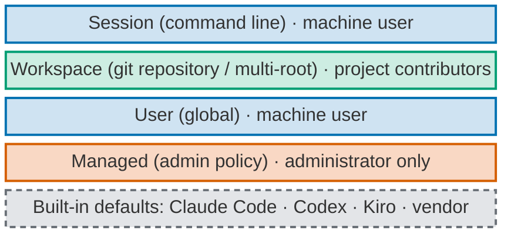
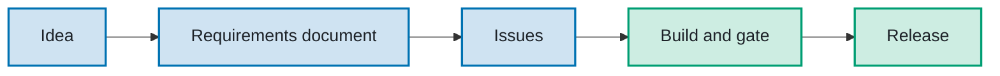

# personal-multi-harness-workstation-configuration

The managed workstation: one versioned source for how every agent harness (Claude Code, Codex and
Kiro) behaves on the owner's devices. One release installs the same protection, standards and working
method into every agent harness, on any of his machines.

This page is the short version. The target behaviour and the reasons for it are in the
[Product Requirements Document](docs/mhw-product-requirements-document-project.md).
The mission, principles and hard rules for agents working here are in [`AGENTS.md`](AGENTS.md).

## Why it exists

Work done with AI agents must respect other people: clients' and employers' confidential material,
third parties' commercial rights and intellectual property, and everyone's personal data. Only the
owner's own knowledge and learning is his. This repository is the protection layer that keeps that line
for every agent at once, and stops credential reads, irreversible commands and unsafe actions while the
agents run. It is also a rehearsal, on one person's workstations, of what a company would roll out to
its engineers.

The command-line agent harnesses come first: they are fast, tile well, scale to many parallel sessions,
and keep configuration in files that can be versioned, tested in CI and installed by one command.
Running the same behaviour on three agent harnesses protects against any one vendor's cost changes,
feature changes and outages.

## Four layers



*Read bottom-up. Grey dashed: vendor. Orange: administrator only. Blue: machine user. Green: project
contributors.*

- **Managed:** a thin protection core that no agent can switch off, because changing it needs `sudo` and
  `sudo` is denied to agents.
- **User:** the global brief, the owner overlay, interaction standards and the working method (agents,
  skills, commands), rendered into each agent harness's native mechanism.
- **Workspace:** only what one project needs, plus a version key that names the workstation release
  range it expects.
- The `tadeumendonca-skills` plugin is a generated copy of the method, never a source and never a
  protection.

Hard locks are kept for irreversible or third-party harm only. Everything else is taught through
instructions, native settings and automatic cleaning, and reported at its real evidence level.

## Workflow



*Read left to right. Blue: the owner decides. Green: the agents carry the work to the end.*

## Current state

The single record of what each control reaches, per agent harness surface and operating system, at
its real evidence level. It replaces the amendment log that `AGENTS.md` used to carry (Issue
[#65](https://github.com/tedeuxx/mhw/issues/65)); that log
stays in the git history.

**Two claims per row, never mixed.** The agent harness columns describe **this source** (the
`rc/next` release candidate, before its v4.0.0 tag). The last column describes **the owner's reference
machine** (macOS), from the last recorded install, and is not re-measured unless it says so.
**Nothing from the release candidate is installed on the reference machine**: installing it is the
owner's act, in a fresh session, after the release-candidate pull request reaches `main`.

| Word | Meaning |
| --- | --- |
| *written* | in the source and covered by the CI suites (Ubuntu and macOS; Windows where `install.ps1` is named) |
| *probed* | installed into a throwaway home on the named version and observed there: *loaded* (the agent harness lists or shows it) or *enforced* (it refused or cleaned on a synthetic input). Never on the owner's machine |
| *documented* | vendor documentation only; not exercised |
| *none* | the agent harness has no carrier for it; the gap is stated, not filled by a hook |
| *installed*, *loaded*, *enforced* | in the last column only: measured on the reference machine |

| Control | Claude Code (CLI) | Codex (CLI) | Kiro (CLI, IDE) | Claude and ChatGPT desktop | OS | Reference machine (last recorded) |
| --- | --- | --- | --- | --- | --- | --- |
| Global brief, with the version key, runtime summary and session goal anchor ([ADR-0010](docs/adr/0010-global-brief-rendered-to-each-harness.md)) | written; loaded, probed (2.1.286) | written; loaded, probed (0.160.0): the goal anchor is in the model-visible prompt | written; documented | pasted by hand; instruction only | macOS, Linux, Windows | an earlier brief *installed*, *loaded* in Claude Code and Codex (2026-10-01). The RC sections are not installed. An instruction, never *enforced* |
| Interaction standards: one question per message, three options, Portuguese with the owner ([ADR-0019](docs/adr/0019-paced-conversation-and-three-path-decisions.md), [ADR-0013](docs/adr/0013-hitl-escalation-calibration.md)) | written, in the brief; instruction only | same | same | pasted by hand | macOS, Linux, Windows | the earlier wording *installed*; its picker guard hook still runs until the owner reinstalls both layers |
| Deny floor, user layer ([ADR-0016](docs/adr/0016-user-level-deny-floor-rendered-per-harness.md)) | written; enforced, probed. A prefix floor; `--setting-sources project` drops it (measured) | written; enforced, probed (`execpolicy`); `--ignore-rules` skips it (help text) | none rendered; a carrier is documented (`toolsSettings.deniedCommands` in CLI 2.x agents, `permissions.yaml` in V3 and the IDE) | none | macOS, Linux, Windows | 101 rules *installed* (2026-10-01, per `install.sh --check` on that machine); not re-measured. The RC's floor is not installed: 136 Claude Code rules and 122 Codex rules with the overlay, 115 and 101 without, read from the `FLOOR` lines of `global/install.sh --check` (and `--overlay=none`) in a throwaway HOME |
| Deny floor, admin layer ([ADR-0016](docs/adr/0016-user-level-deny-floor-rendered-per-harness.md), 2026-10-05 amendment) | written; the managed carrier probed (a managed hook ran, 2.1.289); the deny itself documented | written; `requirements.toml` documented | none rendered; a carrier is documented for the IDE and CLI V3 | documented for the Claude Code tab | macOS, Linux | not installed: the owner's `sudo` act ([runbook](docs/runbooks/deny-floor-admin-layer.md)) |
| Paste wrapper, the primary cleaner ([ADR-0033](docs/adr/0033-paste-cleaning-wrapper-primary-hook-safety-net.md)) | written; enforced, probed (2.1.289): a synthetic paste arrives redacted | written; enforced, probed (0.160.0) | wraps `kiro-cli`; not measured. IDE: none | none | macOS, Linux | an earlier wrapper active in the owner's shell (observed 2026-10-05); the marker logic is not installed |
| Paste prompt hook, the safety net ([ADR-0033](docs/adr/0033-paste-cleaning-wrapper-primary-hook-safety-net.md), [ADR-0025](docs/adr/0025-hook-layers-in-the-native-admin-layer.md)) | written; enforced, probed (2.1.289): blocks without the wrapper's marker, passes with it | written; enforced, probed (0.160.0); runs only after the owner trusts it in `/hooks` | none | none | macOS, Linux | *installed* in the admin layer (v2.1.0); *enforced* on Claude Code (2026-10-04). That copy predates the marker, so it still blocks wrapped sessions |
| Pre-authorisation allow list ([ADR-0031](docs/adr/0031-pre-authorisation-allow-list-behind-the-admin-floor.md)) | written; the permission mode loaded, probed. Wide tier only behind the admin floor. Its `Edit` deny covers only the checkout that ran the installer | written; rules loaded, probed; decisions measured with `execpolicy check` | written, narrow tier; documented | none | macOS, Linux | not installed |
| Working method: 8 agents, 14 skills, 7 commands ([ADR-0032](docs/adr/0032-this-repository-is-the-single-source-of-the-working-method.md)) | written; loaded, probed (2.1.289), each agent's tool list applied | written; skills loaded, probed (0.160.0), commands kept out of implicit use; agents documented, with no tool list | written; documented (agents and skills; commands as skills) | Claude Code tab documented; otherwise none | macOS, Linux, Windows (`install.ps1 -Method`, CI) | not installed: the plugin is still the running copy (#62, #63) |
| Provenance stamp ([ADR-0029](docs/adr/0029-provenance-stamp-in-every-installed-file.md)) | written; stamped files loaded, probed | written; loaded, probed | written; documented | none | macOS, Linux, Windows (CI) | not installed. A record, not a protection |
| `./mhw` (formerly `./mhw`), version key, `status` and `check` ([ADR-0030](docs/adr/0030-version-key-and-one-entry-point.md)) | written; the version-key instruction in the loaded brief, probed | written; in the model-visible prompt, probed | written; documented | none | macOS, Linux | not run. A report, never a block |
| npm install from GitHub by tag, `mhw` command and its `postinstall` ([ADR-0034](docs/adr/0034-npm-distribution-from-github-by-tag.md)) | not an agent harness control | | | | macOS, Linux, Windows (CI) | written. Probed in throwaway prefixes and HOMEs from GitHub at the branch head (npm 11.13.0, macOS): the postinstall installed the stamped user layer and printed the sudo line; upgrade from v4.1.0, a local install and `npm uninstall -g` measured; not installed on the reference machine |
| Prerequisites check, check-only ([#89](https://github.com/tedeuxx/mhw/issues/89)) | not an agent harness control | | | | macOS, Linux | written and tested with fake tools; one read-only run of `gh auth status` and the merge-settings check. Applies nothing |
| GitHub repository standard: merge commits only, no squash ([#82](https://github.com/tedeuxx/mhw/issues/82)) | not an agent harness control | | | | any | written and tested against a stub; `--apply` is the owner's act |
| MCP definition ([ADR-0017](docs/adr/0017-single-source-mcp-with-secret-indirection.md)) | written | written | written | written (Claude desktop) | macOS | not run. Not part of the main line |
| Removed from the source: restart guard, expiring switches, `/breaking-glass`, picker guard, session-type intake ([ADR-0028](docs/adr/0028-remove-restart-guard-and-expiring-switches-os-privilege-only.md)) | written: the installers delete what an earlier version wrote; `--check` reports it as `STALE` | same | none was installed | none | macOS, Linux | still *installed* until the owner reinstalls both layers in a fresh session |

Outside mechanical reach, on every row: the desktop apps' chat surfaces, Windows beyond the brief, the
deny floor and the method, files read by path, pasted images, and sessions not started through the
wrapper. Every protection that is an instruction is best effort: whether a model follows it is not
measured.

## Install

New machine: start with [Install on another workstation](docs/new-workstation.md), which previews the
controls without inheriting the reference owner's overlay.

**With npm, from GitHub by tag** ([ADR-0034](docs/adr/0034-npm-distribution-from-github-by-tag.md),
[runbook](docs/runbooks/npm-install.md)). Nothing is published to the npm registry. You need Node.js 18
or later and git; on macOS and Linux also Python 3.9+ and `jq`. The package and its command are `mhw`
(multi-harness managed workstation):

```sh
npm install -g --foreground-scripts github:tedeuxx/mhw#vX.Y.Z
sudo /bin/sh ".../mhw/global/install-managed.sh" --apply="..." --sha256=...   # macOS and Linux: the line the install printed, only when it printed one
```

The npm line installs and updates every user-level resource itself: its `postinstall` runs `mhw install`,
then prints the admin layer's one `sudo` line when that layer is absent or stale, a reminder to open
fresh agent harness sessions, and the runtime summary. Run the printed `sudo` line yourself, then
`mhw install` once more (the line after it says so). Keep `--foreground-scripts`: without a terminal npm hides a
script's output, and with it the `sudo` line and the restart notice. If the output was missed, `mhw status` repeats the admin step: it prints the next step, `mhw install --admin` and its `sudo` line, while the admin layer is absent or stale.
`MHW_METHOD=1 npm install -g --foreground-scripts …` also renders the working method.

- **Remove:** `mhw uninstall` **before** `npm uninstall -g mhw`. npm 11.13.0 runs no uninstall script
  (measured), so after `npm uninstall -g` alone every user-level resource stays and no `mhw` command is
  left to remove it.
- **`--ignore-scripts`** (or `ignore-scripts=true` in an npmrc): from GitHub the install **fails** and
  leaves a dangling `mhw` link, because npm's git preparation links a temporary clone that only the
  postinstall puts right (measured, npm 11.13.0). Install again without it. From a packed tarball the
  install succeeds and `mhw status` reports `installed by npm but postinstall did not run`.
- **From v4.1.0**, whose package was named `personal-multi-harness-workstation-configuration`: the
  same npm line upgrades, and `mhw status` then names the old package to remove (`npm uninstall -g
  personal-multi-harness-workstation-configuration`), after which the npm line once more restores the
  `workstation` alias.
- `workstation` is a deprecated alias of `mhw` until the next major; it prints one notice.
- The install line names this repository. It changes when the repository is renamed (a separate step).

The first installable tag is the first release that carries `package.json`; older tags fail in npm.
`mhw` takes the same subcommands as `./mhw` below. On Windows it runs `install.ps1`.

**Or from a git clone**, the alternative. macOS and Linux, from the repository root (Python 3.9+ and
`jq` required). **Admin layer first, then the user layer**, on a new machine and on every upgrade
([runbook](docs/runbooks/deny-floor-admin-layer.md)):

```sh
./mhw install --admin  # 1. render and validate the admin layer; prints the one sudo line to run yourself
./mhw install          # 2. user layer, every agent harness; hooks move to the admin layer if it is there
./mhw status           # installed release per layer, protections, the version key, the runtime
./mhw status --verbose # the same, plus every target and each agent harness's version
./mhw check            # run every installer's --check, then the prerequisites; exit non-zero on any finding
./mhw check --prerequisites  # tools and subscriptions only: present, authenticated, drift (docs/prerequisites.md)
./mhw update [vX.Y.Z]  # fetch tags, check out the newest release (or the one given), install it
./mhw uninstall        # remove the user layer; prints the sudo line that removes the admin layer
```

`update` refuses while a tracked file is modified and leaves the checkout detached at the release tag.
In an npm install (no `.git`) it prints the npm command instead and changes nothing.
`uninstall` removes only files carrying this repository's marker and, in `~/.claude/settings.json`, only
its hook entries, the deny-floor rules the installer itself added (recorded in an ownership key, so a
rule you wrote yourself stays even when it equals a floor rule), and its two keys. A single backup
stays beside the file and is overwritten by the next install or uninstall.

`--overlay=DIR|none` selects a profile other than the repository's `overlay/`. `global/install.sh` and
`global/install-managed.sh` stay as the internals ([#67](https://github.com/tedeuxx/mhw/issues/67)).
The `sudo` route to turn a hook off is in the [breaking-glass runbook](docs/runbooks/breaking-glass.md).

**What `check` reports.** `./mhw check` runs `install.sh --check` (with the hooks mode it
detects), `install-managed.sh --check` whenever any admin layer of this repository is on disk (stamped,
or installed by an earlier release without the #66 stamp), and the prerequisites section. When the
admin layer differs, `check`, `install` and `status` name each `STALE` and `DRIFT` target, each removed
control still installed (restart guard, picker guard, session intake, timed breaking-glass) and the
next step, `./mhw install --admin` and its sudo line; `status` says "matches this checkout" ("this package" in an npm install)
only when the user layer and any admin layer both match
([#52](https://github.com/tedeuxx/mhw/issues/52)). The installers' check exits non-zero when a target is missing, differs from this checkout,
is not managed by this repository, carries another release's provenance stamp, or is left over from a
removed control (`STALE`). The prerequisites section exits non-zero when a required item is missing.
It changes nothing.

**What `status` and `check` do not see** (Issue #65, measured in a throwaway home):

- **A rule removed from the deny floor stays orphaned** in `~/.claude/settings.json`. The installer
  merges the floor as a union and never removes a deny entry, so after an update the old rule is still
  in `permissions.deny` and in the ownership key, and `check` exits 0. `uninstall` removes it, because
  it is in the ownership key.
- **An exported `WORKSTATION_OVERLAY` changes the default.** `./mhw` passes `--overlay` to the
  installers through that variable, and `install.sh` and the prerequisites check read it when no
  `--overlay` is given. If it is exported in your shell, a plain `install.sh` or `./mhw
  install` uses that profile instead of the repository's `overlay/`, and no output line says so. With
  `WORKSTATION_OVERLAY=none` exported, `install.sh` dropped the overlay's deny rules and still exited 0:
  `jq '.permissions.deny | length' ~/.claude/settings.json` in the throwaway HOME read 145 for a
  default install and 124 with the variable exported (the floor's 136 or 115, plus the allow list's
  own denies). Unset it, or pass `--overlay=` explicitly.

**Version key.** A project names the workstation release range it expects in `.workstation-version`
(for example `>=4.0 <5`, what this repository expects from the release candidate on). `./mhw
status` compares it with the installed release, and the user brief tells the agent to do the same at
session start. On a mismatch both print one line, required and installed, and the command to run;
nothing blocks ([#57](https://github.com/tedeuxx/mhw/issues/57)).
An install from an untagged checkout of `rc/next` stamps `unreleased, after v3.0.0`, which compares as
3.0.0 and is a mismatch here until v4.0.0 is tagged.

Windows (PowerShell 5.1 and 7, tested in CI) renders the brief and the deny floor, and the working
method with `-Method`. From a clone, or through the npm `mhw` command, which runs the same script:

```powershell
.\global\install.ps1
.\global\install.ps1 -DryRun
.\global\install.ps1 -Check
```

Paste wrapper, the primary paste cleaner: the installer writes a snippet of shell functions and prints
one guarded start-up line. Activating it is the owner's act: add the line yourself, or let the
installer append it to a file you name (`global/install.sh --shell-rc="$HOME/.zshrc"`, idempotent):

```sh
. "$HOME/.local/share/personal-multi-harness-workstation-configuration/paste-filter.sh"
```

Client and employer terms are added from the owner's own terminal, outside any agent session; only a
salted hash is stored, outside this repository:

```sh
/usr/bin/python3 ~/.local/share/personal-multi-harness-workstation-configuration/clipboard_guard.py add-term
```

Every installation on the owner's machine is his act, in a fresh session.

## Decisions and versioning

- Significant decisions are Architecture Decision Records in MADR format in [`docs/adr/`](docs/adr/).
  A record becomes `accepted` only when the owner ratifies it. The [index](docs/adr/README.md) lists
  each record's status and the owner asks still pending.
- Slices merge into the integration branch `rc/next`, by an agent, after the review gate. Only the
  release-candidate pull request `rc/next` → `main` waits for the owner. Every merge to `main` cuts a
  numeric SemVer tag and a GitHub Release through CI; that pull request carries exactly one
  `semver:major`, `semver:minor` or `semver:patch` label
  ([ADR-0002](docs/adr/0002-automatic-semver-cut-policy.md), [ADR-0021](docs/adr/0021-workspace-session-intake-and-ci-publication.md)).
- The session and publication contract for agents working here is in
  [`workspace/README.md`](workspace/README.md).

## Further reading

- [Product Requirements Document](docs/mhw-product-requirements-document-project.md)
- [Agent harness baseline vocabulary](docs/harness-baseline.md)
- [Local persistence inventory](docs/persistence-inventory.md)
