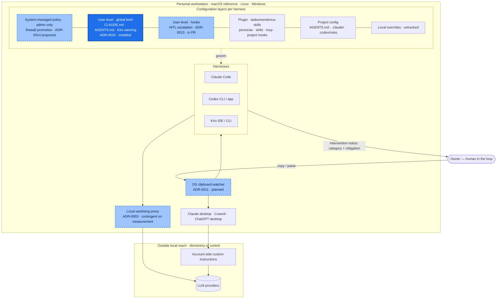

# personal-multi-harness-workstation-configuration

A personal **LLM firewall**, kept as the governed configuration of one developer workstation. It sits
between the owner and every AI agent harness on the machine, and protects him, as a private individual,
from violating third parties' commercial rights and intellectual property in his personal professional
activity. Only his own individual knowledge and learning is his; client and employer material is not.

It does that by sanitising prompts in both directions it can reach: prompts that leave the machine for a
model provider or another service, and prompts passed between agents. It removes secrets and
credentials, personal data, client and employer confidential data, and sensitive personal data. The same
policy is expressed in each harness's own mechanism, so switching tools never silently drops a
protection.

It is also the owner's master of first principles: it places ethical locks on what he himself seeks
to achieve, and those locks are still being defined with him
([ADR-0015](docs/adr/0015-master-of-first-principles-ethical-locks-on-own-aims.md)).

The full mission, the principles and the hard rules for agents working here are in
[`AGENTS.md`](AGENTS.md). The brief installed into every session is
[`global/AGENTS.md`](global/AGENTS.md).

**Status:** bootstrapped 2026-10-01. The policy is still being defined with the owner; several decisions
are still proposed rather than accepted, and the global brief is the only thing installed from here so
far.

## This repository vs the plugin

This repository is the firewall: the personal protection floor. The owner's public plugin,
[`tadeumendonca-skills`](https://github.com/tedeuxx/tadeumendonca-skills), is the way of working:
personas, the delivery loop, skills and project hooks. The plugin may add controls but never weaken the
floor ([ADR-0014](docs/adr/0014-purpose-boundary-firewall-vs-plugin.md)). Being the last barrier is the
firewall's purpose, not yet its mechanism: today its one installed control is a user-level instruction,
which project configuration can override.

| Layer | Owns | May it weaken the floor? |
| --- | --- | --- |
| This repository | The protection floor | It is the floor |
| `tadeumendonca-skills` | The way of working | No, it may only add controls |
| A project's own config | That project's needs | No |

## Architecture of the personal workstation configuration



Legend: solid dark blue means distributed and installed by this repository; light blue dashed means
distributed by this repository but planned, proposed or still in a pull request; unshaded means not
this repository.

The vertical order of the layers is the firewall's view, floor first. It is not the harnesses'
override precedence, where a project value usually beats a user-level one; see
[ADR-0014](docs/adr/0014-purpose-boundary-firewall-vs-plugin.md).

## Install

The global brief has one source, `global/AGENTS.md`, rendered into each harness's user-level location
([ADR-0010](docs/adr/0010-global-brief-rendered-to-each-harness.md)):

| Harness | Target |
| --- | --- |
| Claude Code | `~/.claude/CLAUDE.md` |
| Codex | `${CODEX_HOME:-~/.codex}/AGENTS.md` |
| Kiro | `~/.kiro/steering/workstation-global-brief.md` (with `inclusion: always` front matter) |

macOS and Linux:

```sh
sh global/install.sh            # install or update every target
sh global/install.sh --dry-run  # print exactly what would be written where; write nothing
sh global/install.sh --check    # exit non-zero if a target is missing, drifted or unmanaged
```

Windows (PowerShell), written to mirror `install.sh` and **not yet run on Windows**:

```powershell
.\global\install.ps1
.\global\install.ps1 -DryRun
.\global\install.ps1 -Check
```

Each rendered file carries a marker line with the source version and its SHA-256. The installer never
overwrites a file without that marker; it refuses and exits 3 instead. Exit codes: `0` ok, `1` drift or
missing (`--check`), `2` usage, `3` an unmanaged file is in the way.

`global/install.test.sh <base dir>` exercises the installer against throwaway home directories, never
the real one.

## Decisions

Every significant decision is an ADR in MADR format in [`docs/adr/`](docs/adr/), numbered
sequentially. Each record states its own status (`proposed`, `accepted`, `superseded` or `rejected`);
a record becomes `accepted` only when the owner ratifies it.

## Versioning

Every merge to `main` cuts a numeric SemVer tag with bump-my-version. A pull request carries exactly one
`semver:major`, `semver:minor` or `semver:patch` label, and a check fails without it
([ADR-0002](docs/adr/0002-automatic-semver-cut-policy.md), proposed).

## Reference workstation

The machine this policy set is developed and installed on. These facts were **observed on 2026-10-01**.
They describe that day's state and are not a supported or guaranteed configuration; versions move
whenever a tool updates.

### Hardware and OS

| | |
| --- | --- |
| Machine | Mac mini (Mac16,10) |
| Chip | Apple M4, 10 cores (4 performance + 6 efficiency) |
| Memory | 16 GB |
| Architecture | arm64 |
| OS | macOS 26.6.2 (25G83) |
| Shell | zsh |
| Terminal | iTerm2 |
| Editors | VS Code, Kiro |

### Agent harnesses

| Harness | Version / form |
| --- | --- |
| Claude Code | 2.1.286 (CLI) |
| Claude desktop app | installed, including Cowork |
| Codex CLI | 0.155.0-alpha.16.4, bundled with the ChatGPT desktop app |
| ChatGPT desktop app | installed |
| Kiro IDE | 1.0.437 |
| Kiro CLI | not installed |

### Access modes

See [ADR-0003](docs/adr/0003-distribution-requirements-access-modes.md).

| Vendor | How the model is reached |
| --- | --- |
| Anthropic (Claude) | the owner's top-tier personal subscription, subscription login |
| OpenAI (Codex, ChatGPT) | the owner's top-tier personal subscription, subscription login |
| Kiro | no active subscription |

### Plugins

- **Claude Code:** the owner's own public plugin, `tadeumendonca-skills`, from the marketplace
  [`tedeuxx/tadeumendonca-skills`](https://github.com/tedeuxx/tadeumendonca-skills).
- **Codex:** the same plugin, plus plugins bundled by the vendor.

### MCP servers

Listed by category only. Server names and launch commands are deliberately not published here.

- cloud provider API, read-only
- source control
- maps
- spreadsheets
- professional network
- productivity suite
- messaging
- media and streaming
- market data
- video platform
- file transfer

They are configured independently in the Claude desktop app and in Codex; each surface keeps its own
configuration ([ADR-0006](docs/adr/0006-coverage-scope-all-agent-surfaces.md)).

### Toolchain

| Tool | Version |
| --- | --- |
| git | 2.52.0 |
| GitHub CLI (`gh`) | 2.93.0 |
| Node.js / npm | 25.9.0 / 11.13.0 |
| Python | 3.14.6 |
| uv | 0.11.30 |
| Terraform | 1.12.1 |
| AWS CLI | 2.32.28 |
| Podman | 5.7.1 |
| jq | 1.7.1 |
| ShellCheck | installed |
| actionlint | 1.7.12 |
| bump-my-version | installed |
| Homebrew | 7.0.7 |

### Global brief on this machine

Installed by `global/install.sh` into all three user-level locations above, and `--check` reports them
in sync at version 0.1.0. **Evidence level: installed.** It has not yet been verified that a fresh
session of each harness actually loads the brief, so "loaded" and "enforced" are not claimed.
