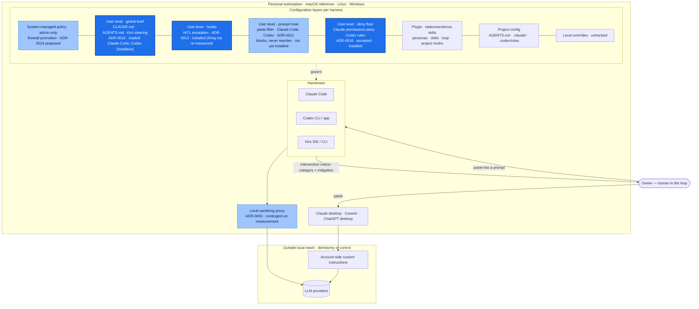

# personal-multi-harness-workstation-configuration

A personal **LLM firewall**, kept as the governed configuration of one developer workstation. It sits
between the owner and every AI agent harness on the machine, and protects him, as a private individual,
from violating third parties' commercial rights and intellectual property in his personal professional
activity. Only his own individual knowledge and learning is his; client and employer material is not.

It does that by sanitising prompts in both directions it can reach: prompts that leave the machine for a
model provider or another service, and prompts passed between agents. It removes secrets and
credentials, personal data, client and employer confidential data, and sensitive personal data. The same
policy is expressed in each harness's own mechanism, so switching tools never silently drops a
protection.

It is also the owner's master of first principles: it places ethical locks on what he himself seeks
to achieve, and those locks are still being defined with him
([ADR-0015](docs/adr/0015-master-of-first-principles-ethical-locks-on-own-aims.md)).

The full mission, the principles and the hard rules for agents working here are in
[`AGENTS.md`](AGENTS.md). The brief installed into every session is
[`global/AGENTS.md`](global/AGENTS.md).

**Status:** bootstrapped 2026-10-01. The policy is still being defined with the owner, and several
decisions are still proposed rather than accepted. On 2026-10-01 `global/install.sh` ran on the
reference machine from v0.7.0 with `--check` clean (Issue #4). That installed the global brief, the
HITL escalation guard ([ADR-0013](docs/adr/0013-hitl-escalation-calibration.md); firing there not
re-measured) and the user-level deny floor
([ADR-0016](docs/adr/0016-user-level-deny-floor-rendered-per-harness.md), accepted; enforcement there
not re-measured). The always-on macOS clipboard watcher was withdrawn on the owner's correction
(Issue #5): it is stopped on the reference machine and this version no longer installs it. In its place
a paste filter blocks a prompt carrying a finding at the Claude Code and Codex prompt
([ADR-0011](docs/adr/0011-clipboard-prompt-anonymisation.md), mechanism proposed; measured headless,
not yet installed on the reference machine). The MCP renderer
([ADR-0017](docs/adr/0017-single-source-mcp-with-secret-indirection.md), proposed) has not been run
there (Issue #8). Per-component evidence levels are in [`AGENTS.md`](AGENTS.md), "Status".

## This repository vs the plugin

This repository is the firewall: the personal protection floor. The owner's public plugin,
[`tadeumendonca-skills`](https://github.com/tedeuxx/tadeumendonca-skills), is the way of working:
personas, the delivery loop, skills and project hooks. The plugin may add controls but never weaken the
floor ([ADR-0014](docs/adr/0014-purpose-boundary-firewall-vs-plugin.md)). Being the last barrier is the
firewall's purpose. Its first mechanical control, a user-level deny floor that a project cannot carve
out in Claude Code, is accepted and was installed on the reference workstation on 2026-10-01
([ADR-0016](docs/adr/0016-user-level-deny-floor-rendered-per-harness.md)). It is a prefix floor, not a
wall: other spellings of a denied command escape it, and the global brief is still an instruction that
project configuration can override.

| Layer | Owns | May it weaken the floor? |
| --- | --- | --- |
| This repository | The protection floor | It is the floor |
| `tadeumendonca-skills` | The way of working | No, it may only add controls |
| A project's own config | That project's needs | No |

## Architecture of the personal workstation configuration



Legend: solid dark blue means distributed and installed by this repository; light blue dashed means
distributed by this repository but planned, proposed or still in a pull request;
unshaded means not this repository.

The vertical order of the layers is the firewall's view, floor first. It is not the harnesses'
override precedence, where a project value usually beats a user-level one; see
[ADR-0014](docs/adr/0014-purpose-boundary-firewall-vs-plugin.md).

## Install

The global brief has one source, `global/AGENTS.md`, rendered into each harness's user-level location
([ADR-0010](docs/adr/0010-global-brief-rendered-to-each-harness.md)):

| Harness | Target |
| --- | --- |
| Claude Code | `~/.claude/CLAUDE.md` |
| Codex | `${CODEX_HOME:-~/.codex}/AGENTS.md` |
| Kiro (IDE and CLI) | `~/.kiro/steering/workstation-global-brief.md` (with `inclusion: always` front matter). Kiro CLI reads the same global steering directory, documented; a custom agent loads it only if listed in its `resources` |

macOS and Linux (CI runs the suite on macOS and on Ubuntu, where `/bin/sh` is dash):

```sh
sh global/install.sh            # install or update every target
sh global/install.sh --dry-run  # print exactly what would be written where; write nothing
sh global/install.sh --check    # exit non-zero if a target is missing, drifted or unmanaged
```

Windows (PowerShell). Tested in CI on a Windows runner under Windows PowerShell 5.1 and PowerShell 7
(`global/install.test.ps1`). It renders the brief and the deny floor only: the HITL guard and the
paste filter are not ported. The per-feature parity table is in
[ADR-0010](docs/adr/0010-global-brief-rendered-to-each-harness.md):

```powershell
.\global\install.ps1
.\global\install.ps1 -DryRun
.\global\install.ps1 -Check
```

The same run installs the user-level deny floor, one source (`global/deny-floor.conf`, plus
`overlay/deny-floor.conf` when present) rendered per harness
([ADR-0016](docs/adr/0016-user-level-deny-floor-rendered-per-harness.md)):

| Harness | Target |
| --- | --- |
| Claude Code | `permissions.deny` in `~/.claude/settings.json`, merged as a union: no existing rule is removed, a backup is kept |
| Codex | `${CODEX_HOME:-~/.codex}/rules/workstation-deny-floor.rules` (`prefix_rule(…, decision="forbidden")`) |
| Kiro | nothing: no rule layer is established for it |

Each rendered file carries a marker line with the source version (the briefs also carry the SHA-256 of
their source). The installer never overwrites a file without that marker; it refuses and exits 3
instead. `~/.claude/settings.json` carries no marker: it is merged, never overwritten. Exit codes: `0`
ok, `1` drift or missing (`--check`), `2` usage or an invalid deny-floor entry, `3` an unmanaged or
unreadable file is in the way.

`global/install.test.sh <base dir>` exercises the installer against throwaway home directories, never
the real one.

### Paste filter at the harness-CLI prompt (macOS and Linux)

The same run installs the paste filter
([ADR-0011](docs/adr/0011-clipboard-prompt-anonymisation.md), amendment "the always-on watcher is
withdrawn"): a user-level `UserPromptSubmit` hook that scans what you submit to Claude Code or Codex,
pasted content included, for a known employer or client term, a credential, an e-mail address, a payment
card, a CPF or a CNPJ. On a finding it **blocks** the prompt, names the category, and shows a redacted
copy you can submit instead. It never rewrites the prompt, never touches the system clipboard, and calls
no dialog or notification tool. Once you have added a term, it reads the salt from your login Keychain on
each prompt, but only after a non-interactive check says the keychain is unlocked, and with a 2-second
limit. Otherwise term matching is skipped with a visible warning. Whether a locked keychain would have
raised a dialog is not measured: the check exists so that it is never asked.

A blocked prompt is not kept off disk. Claude Code documents that the text can remain in the transcript
and prompt history. For Codex this is not measured, so assume it persists. See ADR-0011, "Residuals".

- the core and its settings (`global/clipboard.conf`, then `overlay/clipboard.conf`) under
  `${XDG_DATA_HOME:-~/.local/share}/personal-multi-harness-workstation-configuration/`;
- Claude Code: one `UserPromptSubmit` entry merged into `~/.claude/settings.json`;
- Codex: `${CODEX_HOME:-~/.codex}/hooks.json`. **Codex skips it until you trust it**: open `/hooks` in
  Codex, review the entry, trust it. That is your act; the installer writes no trust state.

It needs `/usr/bin/python3` (on macOS, the Command Line Tools). An earlier version installed an always-on
clipboard watcher as a LaunchAgent; the installer now removes that plist if it wrote it, and prints the
`launchctl bootout` command instead of running it.

Add an employer or client term from **your own terminal, outside any agent session**. The term is read
with echo off and only its salted hash is stored, in the local overlay outside this repository:

```sh
/usr/bin/python3 ~/.local/share/personal-multi-harness-workstation-configuration/clipboard_guard.py add-term
```

`python3 -B global/clipboard/clipboard_guard_test.py <empty dir>` runs its suite. On macOS the suite
uses a namespaced Keychain item and deletes it; it never reads or writes the system clipboard.

### MCP servers: one definition, credentials at launch

One definition renders each surface's local MCP servers
([ADR-0017](docs/adr/0017-single-source-mcp-with-secret-indirection.md), proposed). The definition is
**not** in this repository: it lives in the untracked local overlay,
`${XDG_DATA_HOME:-~/.local/share}/personal-multi-harness-workstation-configuration/local-overlay/mcp-servers.json`.
Start from the synthetic [`global/mcp/mcp-servers.example.json`](global/mcp/mcp-servers.example.json). A
credential is never written in it. It is named under `secrets` with its source, and
`global/mcp/mcp-launch.sh` reads it from the macOS Keychain when the server starts.

| Surface | Target |
| --- | --- |
| Codex | `[mcp_servers.*]` in `${CODEX_HOME:-~/.codex}/config.toml`, inside one marked block; nothing outside it is edited |
| Claude Code | `mcpServers` in `~/.claude.json` (user scope) |
| Claude desktop app | `mcpServers` in its `claude_desktop_config.json` (macOS, Windows) |
| Kiro IDE and CLI | `mcpServers` in `~/.kiro/settings/mcp.json` |

```sh
python3 global/mcp/mcp_render.py --scan     # owner only: credential-looking key NAMES in today's configs
python3 global/mcp/mcp_render.py --dry-run  # what would change where; never prints a current value
python3 global/mcp/mcp_render.py            # render (a backup is kept beside each file)
python3 global/mcp/mcp_render.py --check    # exit 1 on drift
```

It needs Python 3.11 or later. **It is not installed on the reference machine.** Inside an agent session
it refuses `--scan`, and refuses any write outside a throwaway home (`CODEX_HOME` and `XDG_DATA_HOME`
included). That refusal reads environment markers a process can unset: it is a speed bump, not a
control. Before installing, quit the apps that write these files, including every running Claude Code
CLI session. The migration steps are in ADR-0017.
`python3 -B global/mcp/mcp_render_test.py <empty dir>` runs its suite in throwaway homes.

## Decisions

Every significant decision is an ADR in MADR format in [`docs/adr/`](docs/adr/), numbered
sequentially. Each record states its own status (`proposed`, `accepted`, `superseded` or `rejected`);
a record becomes `accepted` only when the owner ratifies it.

## Versioning

Every merge to `main` cuts a numeric SemVer tag with bump-my-version. A pull request carries exactly one
`semver:major`, `semver:minor` or `semver:patch` label, and a check fails without it
([ADR-0002](docs/adr/0002-automatic-semver-cut-policy.md), proposed).

## Reference workstation

The machine this policy set is developed and installed on. These facts were **observed on 2026-10-01**.
They describe that day's state and are not a supported or guaranteed configuration; versions move
whenever a tool updates.

### Hardware and OS

| | |
| --- | --- |
| Machine | Mac mini (Mac16,10) |
| Chip | Apple M4, 10 cores (4 performance + 6 efficiency) |
| Memory | 16 GB |
| Architecture | arm64 |
| OS | macOS 26.6.2 (25G83) |
| Shell | zsh |
| Terminal | iTerm2 |
| Editors | VS Code, Kiro |

### Agent harnesses

| Harness | Version / form |
| --- | --- |
| Claude Code | 2.1.286 (CLI) |
| Claude desktop app | installed, including Cowork |
| Codex CLI | 0.155.0-alpha.16.4, bundled with the ChatGPT desktop app |
| ChatGPT desktop app | installed |
| Kiro IDE | 1.0.437 |
| Kiro CLI | not installed (its global brief location is documented: `~/.kiro/steering/`, ADR-0010) |

### Access modes

See [ADR-0003](docs/adr/0003-distribution-requirements-access-modes.md).

| Vendor | How the model is reached |
| --- | --- |
| Anthropic (Claude) | the owner's top-tier personal subscription, subscription login |
| OpenAI (Codex, ChatGPT) | the owner's top-tier personal subscription, subscription login |
| Kiro | no active subscription |

### Plugins

- **Claude Code:** the owner's own public plugin, `tadeumendonca-skills`, from the marketplace
  [`tedeuxx/tadeumendonca-skills`](https://github.com/tedeuxx/tadeumendonca-skills).
- **Codex:** the same plugin, plus plugins bundled by the vendor, plus eight plugins enabled from a
  Cowork plugin marketplace.

### MCP servers

Listed by category only. Server names and launch commands are deliberately not published here.

- cloud provider API, read-only
- source control
- maps
- spreadsheets
- professional network
- productivity suite
- messaging
- media and streaming
- market data
- video platform
- file transfer

They are configured independently in the Claude desktop app and in Codex; each surface keeps its own
configuration ([ADR-0006](docs/adr/0006-coverage-scope-all-agent-surfaces.md)). A single definition for them
is written ([ADR-0017](docs/adr/0017-single-source-mcp-with-secret-indirection.md)) and not yet
installed.

### Toolchain

| Tool | Version |
| --- | --- |
| git | 2.52.0 |
| GitHub CLI (`gh`) | 2.93.0 |
| Node.js / npm | 25.9.0 / 11.13.0 |
| Python | 3.14.6 |
| uv | 0.11.30 |
| Terraform | 1.12.1 |
| AWS CLI | 2.32.28 |
| Podman | 5.7.1 |
| jq | 1.7.1 |
| ShellCheck | installed |
| actionlint | 1.7.12 |
| bump-my-version | CI only (not installed locally) |
| Homebrew | 7.0.7 |

### Local persistence on this machine

[`docs/persistence-inventory.md`](docs/persistence-inventory.md) inventories, per surface, what each
agent surface stores locally: transcripts, history, memory, uploads, caches and logs. For each store it
gives the retention and the setting that controls it. The inventory was built from metadata only. The
stores that conflict with
[ADR-0008](docs/adr/0008-personal-workstation-no-confidential-persistence.md), and candidate controls
for them, are in that record's 2026-10-01 amendment. The controls are proposed, not installed.

### Global brief on this machine

Installed by `global/install.sh` into all three user-level locations above, and `--check` reports them
in sync at version 0.7.0 (the 2026-10-01 install, Issue #4). **Evidence level: loaded for Claude Code and Codex, measured headless
(2026-10-01). Kiro remains documented.** A fresh `claude -p` and a fresh `codex exec`, each run with
tools disabled in an unrelated empty directory, quoted the brief's title and rule 1 verbatim. Each
calibration run returned `NOT_IN_CONTEXT` once the user-level brief was removed from its sources.
Interactive sessions were not measured. The brief is an instruction, and "enforced" is not claimed.
Commands and bounds: [ADR-0010](docs/adr/0010-global-brief-rendered-to-each-harness.md), amendment
2026-10-01 on loading.
