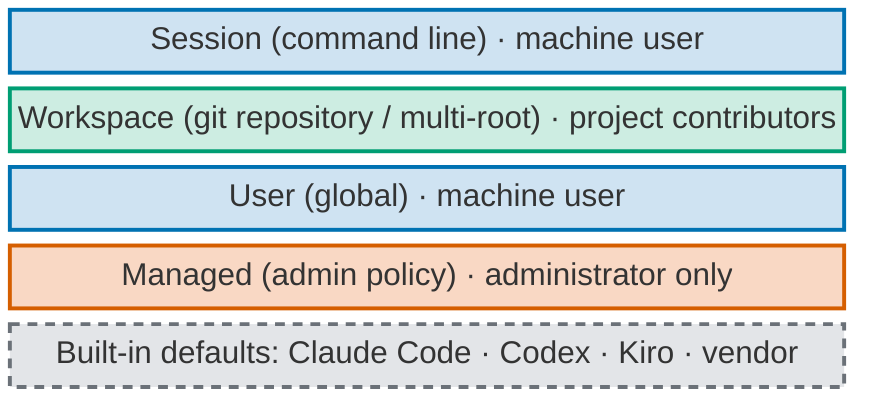
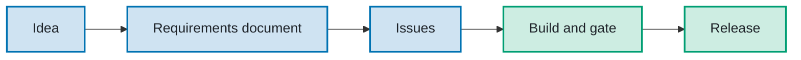

# Managed workstation: Product Requirements Document (project)

One versioned source for how every agent harness behaves on the owner's devices.

- **Status:** approved by the owner, revision 3, 2026-10-05. Revision 4 (2026-10-05, Issue #65) mirrors
  the decisions taken since on the Issues, without new ones: the `rc/next` route, the interaction
  standards, paste cleaning, the capability skills, the pre-authorisation tiers, prerequisites as
  check-only, GitHub as the only code host, no per-request waivers, and perimeter defence. Items marked
  *open decision* or *draft* are not yet decided.
- **Source:** the setup review on [#52](https://github.com/tedeuxx/personal-multi-harness-workstation-configuration/issues/52),
  the owner interview on [#54](https://github.com/tedeuxx/personal-multi-harness-workstation-configuration/issues/54),
  and the slices [#55](https://github.com/tedeuxx/personal-multi-harness-workstation-configuration/issues/55)
  to [#69](https://github.com/tedeuxx/personal-multi-harness-workstation-configuration/issues/69).
- **How to read it:** this document describes the target behaviour and why. The decisions taken to get
  there, and the order of the work, live in the Issues and in the decision records
  ([`docs/adr/`](adr/)).

This repository is the single, versioned source of agent harness configuration for the owner's devices.
A thin protection core is enforced in the admin layer. Interaction standards and the working method are
distributed at user level to Claude Code, Codex and Kiro. The `tadeumendonca-skills` plugin is not a
source: it is a CI-generated artifact of this repository.

## 0. Introduction

- **What this is:** the managed workstation, a single versioned source for how agent harnesses (Claude
  Code, Codex and Kiro) behave on the owner's devices. One release installs the same protection,
  standards and working method into every agent harness, on any of his machines.
- **Why it exists:** to make sure that work done with AI agents respects other people: clients' and
  employers' confidential material, third parties' commercial rights and intellectual property, and
  everyone's personal data. It is a **defence layer for groups of agents**: when many agents work in
  parallel, the same protection applies to every one of them, so no single agent can leak what the
  others are kept from leaking. More broadly, it **reduces security risk at run time**: credential
  reads, irreversible commands and unsafe actions are stopped while the agents run, not discovered
  afterwards. On that foundation it keeps the owner's own work clean, because only his own knowledge is
  his. It also lets him work with agents every day in a way that is fast, consistent and verifiable.
- **A rehearsal for corporate adoption:** the same layers, enforcement mechanisms and workflow that a
  company would roll out to its engineers are practised here on one person's workstations first. What
  works, what each agent harness can really enforce, and what it costs are learned before anyone
  proposes this approach at company scale.
- **Who it is for:** first the owner. Then anyone who wants to replicate the setup on their own
  workstation, with owner-specific values kept apart in an overlay.

## 1. Problem

- Configuration is split across three places (this repository, the plugin, each project), with a
  different distribution mechanism per agent harness. Manual invocation, hooks and skills behave
  differently in each one, so behaviour drifts and replication to another device is manual.
- The plugin and this repository both carry protections, and some of them overlap (secret writes and
  force-push, the one-question picker guard, stale-install checks).
- Several controls cost more than they protect. The restart guard locked the owner out and blocks
  commits after routine edits; the picker guard refuses yes/no questions; installation needs remembered
  flags and five steps per preference change.
- The front page and status text describe an old version and over-claim coverage: subagent sanitising
  and health-data detection are instruction only.
- Configuration management for agent harnesses is a high-complexity problem in its own right.

## 1a. Why the command line first

The workstation is built around the command-line agent harnesses: Claude Code, Codex CLI and Kiro CLI.

### The main reasons (owner)

1. **Speed.** A terminal session starts and responds faster than a desktop app.
2. **Responsive tiling.** Terminal windows tile cleanly with a window manager (Rectangle on macOS), so
   several sessions sit side by side and stay usable at any size.
3. **Sessions that scale.** Many sessions run in parallel. Each one is just a process, so it can run in
   its own container.
4. **The right mindset for working with AI.** The terminal frames the work as giving direct,
   executive-level instructions to a machine. The stance is *trust but verify*: every command the agent
   runs, and its output, is on screen to check.

### What the command line also makes possible

- **Configuration is files.** Files can be versioned, stamped with a release, installed by one command
  and replicated on another device. Desktop apps keep much of their configuration in their own interface
  and account.
- **Enforcement is documented and testable.** Admin-managed settings, permission rules and hooks can be
  exercised in a throwaway home in CI before they reach the owner's machine.
- **The terminal is where paste cleaning can happen**, before the agent harness sees the text.

What this leaves out, stated rather than hidden: the Claude and ChatGPT desktop apps receive the brief by
manual paste and carry no mechanical control. Windows receives only the brief and the deny floor.
Whether the IDE extensions read the same files as their command-line tools is measured in the
[enforcement matrix](#10-native-enforcement-matrix).

## 1b. Business case

### Why several agent harnesses

Running the same behaviour on three agent harnesses is the strategy that best protects a company
against changes at each vendor:

- **Cost changes:** pricing, plan limits and token rates move. Work shifts to whichever agent harness
  gives the best cost for the job, and the [worklog](#measurement-for-an-economic-drive) shows the
  numbers.
- **Feature changes:** a capability added, changed or removed in one agent harness does not stop the
  work. The same agents, commands and standards exist in the others.
- **Outages:** when one vendor is down, the session continues in another agent harness with the same
  configuration. Paid working hours are not lost waiting for a single vendor to come back, for internal
  and external collaborators alike.

This is the business reason for the single source and its rendering into each agent harness. Changing
agent harness costs one command, not a migration.

> **To be completed with the owner**, one question at a time: value proposition, audiences, costs,
> returns, metrics and risks. Also to decide: which parts are public in this repository and which stay
> private.

## 1c. Ten commandments for working with an agent harness every day

> **Draft, pending the owner's ratification.** Written from his own statements during the review, for him
> to edit and ratify. Once ratified, they are the behavioural anchor of every agent harness on the
> workstation: they are written at the top of the user-level brief rendered to Claude Code, Codex and
> Kiro, so every session and every agent starts from them. Until then they are not installed anywhere
> ([#77](https://github.com/tedeuxx/personal-multi-harness-workstation-configuration/issues/77)).

1. **Native first, thin on top, one source for all.** Use each agent harness's own mechanisms before
   building anything custom, and render one versioned source into every agent harness, so switching
   vendor costs one command, not a migration. A thin layer benefits most from how the agent harnesses
   evolve: each vendor improvement arrives for free, and there is less custom code to retest along the
   way.
2. **Talk like executives with your agents.** Communication between people and agents is direct in both
   directions: plain instructions in, plain results out. Clarifying questions are optional, asked only
   when a decision truly needs one. Fewer words each way also saves tokens.
3. **No build without an agreed document.** An idea becomes a requirements document before it becomes
   code, because that document is the refined context the agents work from: a clear, agreed brief
   instead of a scattered conversation.
4. **All agent work runs on the issue tracker.** Every piece of agent work is tied to an Issue, so agile
   delivery metrics and the cost of each agent session can be measured against the work it served. The
   tracker is also a shared context bus: sessions running in parallel, in any agent harness, read and
   write the same context there.
5. **The orchestrator talks, the agents work.** The session I talk to delegates every task and keeps its
   own context light.
6. **Best-effort enforcement over hard mechanical hooks.** Behaviour is taught through instructions,
   skills and native settings, accepting a best-effort result. A hard mechanical hook is used only for
   irreversible harm or harm to third parties, where teaching would act too late.
7. **Clean, don't ask.** Sensitive content is removed automatically, never logged or sent back for
   approval.
8. **Track agent harness consumption per Issue.** Every task done with an agent harness records its cost
   (tokens, model and effort) on its Issue. This builds cost observability over time, and that evidence
   can change how the workflow itself is configured: which agent harness, model and effort each kind of
   task gets.
9. **Less is more.** Plain words any native speaker of any language understands, simple diagrams, one
   decision at a time.
10. **Use conflict between agents to reach consensus.** Where it adds value, agents with opposing lenses
    disagree first and agree on one answer. When speed matters more, use fewer agents per layer of the
    workflow.

## 2. Goals and principles (from the owner)

1. **Thin protection.** In the owner's words (translated): "the smallest intervention already covers
   most of the harmful scenarios". Start small, mature through use.
2. **One layer, every agent harness.** Configuration lives at the workstation user level, not at plugin
   or project level, so one mechanism serves Claude Code, Codex and Kiro, and behaviour is managed,
   versioned and replicable across workspaces and devices.
3. **Practise corporate enforcement.** Use the same layers a corporate administrator uses
   (admin-managed settings, user settings, project settings) to learn what each agent harness can
   enforce.
4. **Soft before hard.** In the owner's words (translated): "steer the agent harness toward good
   behaviour and prevent bad behaviour". Hard locks only for irreversible or third-party harm.
   Everything else works through instructions, good defaults, automatic cleaning and visible notices.
   No grace periods or change rituals at this layer.
5. **Clean, don't ask.** Pasted sensitive content is cleaned automatically, not logged or sent back for
   approval.
6. **Golden rule: native first, the same level across agent harnesses.** Written into the user-level
   brief, so every agent in every agent harness applies it. One general behavioural baseline for every
   agent harness, built from each agent harness's own native components (agents, skills, commands,
   steering, permission rules) and preferring them. Custom code fills a gap only where no native
   component exists, and the gap is recorded in the [enforcement matrix](#10-native-enforcement-matrix).
7. **Teach rather than lock.** Hooks are mechanical locks. Keep them to the minimum and replace them with
   behaviour taught through briefs, skills and agent instructions, accepting a best-effort result. Every
   hook that remains must pass the [hook budget](#4a-hook-budget).
8. **Perimeter, not behaviour.** *Draft, proposed on #77, pending the owner's ratification.* In the owner's words (translated, #77): "every attempt to build
   explicit blocking of agent behaviour, or hard control over how agents behave, has proved
   ineffective. Perimeter defence is therefore the right approach." The workstation protects the
   boundary: the managed layer that only an administrator changes, the operating system's privilege
   model, and native deny rules on irreversible actions. Inside that perimeter, behaviour is taught and
   accepted as best effort. Until he ratifies it, this principle is not installed anywhere
   ([1c](#1c-ten-commandments-for-working-with-an-agent-harness-every-day)).
9. **No per-request waivers; exceptions only through `sudo`.** In the owner's words (translated, #52):
   "no mechanical lock may require individual, temporary waiver requests unless the waiver is tied to a
   privilege level that stays valid for the whole session. `sudo`/`su` serves that purpose." A
   protection in the managed layer is changed or switched off only by an administrator with `sudo`, as
   any operating-system policy is. There is no expiring switch and no per-request exception
   ([ADR-0028](adr/0028-remove-restart-guard-and-expiring-switches-os-privilege-only.md)).
10. **GitHub is the only code host.** In the owner's words (translated, #89): "GitLab is not a target of
    this distribution; focus on GitHub only." The source-control and CI skills, the repository-settings
    standard and the prerequisites declaration name GitHub and nothing else.

### Non-goals

- Uniform mechanical enforcement on every surface. Desktop apps and Windows stay at instruction level,
  and the gap is stated.
- Tamper resistance against the owner himself.
- Legal advice. The owner's contracts govern.

## 3. Architecture: four layers

Read bottom-up. Each layer names who can change it, and the colour says the same: grey dashed, the
vendor; orange, an **administrator** only; blue, the ordinary **machine user**; green, the repository's
contributors. Layer names follow the vendors' own documentation; Claude Code and Codex call the
Workspace layer "Project". Who wins on a conflict differs per agent harness
([3a](#3a-where-the-agent-harnesses-differ)).

*Read bottom-up. Grey dashed: vendor. Orange: administrator only. Blue: machine user. Green: project
contributors.*

**Managed versus User is administrator versus ordinary user.** The User layer lives in the owner's home
folder, so his account can change it, and so can every agent, because agents run as his user. The
Managed layer lives in a system folder owned by root, so only an administrator (`sudo`) can change it.
Agents cannot, because `sudo` is denied to them. That is why the protection core sits in Managed: no
agent can switch it off.

Precedence follows the corporate model: managed overrides user, user overrides workspace, and where two
layers disagree on a protection the stricter one wins. Kiro has no admin-managed carrier for these
controls, so it receives the user and workspace layers only (stated in the
[enforcement matrix](#10-native-enforcement-matrix)).

| Layer | Lives in | Installed by | Holds | Who can change it |
| --- | --- | --- | --- | --- |
| **Managed** (admin) | this repository | the admin-layer install, one `sudo` line | The thin protection core only ([4](#4-protection-core-managed-layer)) | root; never the agent (`sudo` is in the deny floor) |
| **User** | this repository | the installer, rendered per agent harness | Global brief, owner overlay, interaction standards ([5](#5-interaction-standards-user-layer)), working method ([6](#6-working-method-user-layer)) | the owner, through a release of this repository |
| **Workspace** | each project | the project itself | What only that project needs, plus the version key ([7](#7-version-key-per-project)) | that project's own flow |
| **Plugin** | `tadeumendonca-skills` | generated by CI from this repository | A packaged copy of the method for plugin users; never protections | nobody by hand (read-only mirror) |

**Placement rule** (ADR-0026, proposed, to be ratified): an artifact lives in exactly one layer; a copy in
a lower layer is a defect; where two layers disagree, the stricter applies; new protection is installed
before the old copy is removed.

## 3a. Where the agent harnesses differ

The stack above is the shared model. The vendor documentation (read 2026-10-05) shows four differences;
everything else follows the stack.

| Topic | Claude Code | Codex | Kiro |
| --- | --- | --- | --- |
| Who wins on a setting conflict | The admin-managed layer beats everything, session flags included. Below it: session > repository local > repository shared > user. | Admin-managed defaults and requirements beat everything, session flags included. Below it: session > repository > profile > user > system. | Closest scope wins (agent > repository > global). Permissions are different: **a deny wins at any layer**. |
| Extra layer | The repository has two parts: shared and personal (`settings.local.json`) | **Profiles** sit between user and repository; repository configuration loads only in trusted repositories | An **agent** scope sits above the repository |
| Instruction files | Concatenated: managed, user, repository, local. The managed file cannot be excluded; `AGENTS.md` is skipped when a `CLAUDE.md` exists | Concatenated from global down to the working directory; the later (closer) file wins; 32 KiB cap; `AGENTS.override.md` escape | Global and repository steering merged; the repository wins on conflict |
| Admin carrier | Managed settings file, MDM or server-managed | `requirements.toml` / managed configuration, MDM or cloud | Organisation shared settings and a local `managed-settings.json` (permissions and sign-in only) |

Sources (evidence level: documented):
[Claude Code settings](https://code.claude.com/docs/en/settings) ·
[Claude Code memory](https://code.claude.com/docs/en/memory) ·
[Codex config](https://learn.chatgpt.com/docs/config-file/config-basic) ·
[Codex managed configuration](https://learn.chatgpt.com/docs/enterprise/managed-configuration) ·
[Kiro configuration](https://kiro.dev/docs/configuration/) ·
[Kiro permissions](https://kiro.dev/docs/permissions/) ·
[Kiro steering](https://kiro.dev/docs/steering/index).
Not found in the documentation: where plugins rank as a layer (all three), the path of Kiro's managed
file, and Kiro IDE user versus workspace precedence.

## 3b. Workflow

**Goal:** any idea becomes a released, verified change in any of the three agent harnesses. The owner
makes the decisions; the agents do the rest.

*Read left to right. Blue: the owner decides. Green: the agents carry the work to the end.*

### The orchestrating session

**Its one job:** to make communication between the owner and the group of agents simple. It is the
single session he talks to, and it dispatches the working method's agents ([6](#6-working-method-user-layer))
as subagents.

- **Toward the agents:** turns what he says into a minimal, sanitised brief for the right agent
  (firewall rule 2).
- **Toward him:** turns what the agents return into a short answer, and brings him only the decisions
  that are his, one at a time.
- **Nothing else lives at its level.** Building, reviewing, gating and ordering the work belong to the
  agents, each with its own skills and tool list. The orchestrator keeps no logic of its own beyond
  relaying.
- **It keeps its own level light.** Any task that lands on it (reading files, editing, running commands,
  research) is handed to a subagent. Its own context stays small, so the conversation with him stays
  fast and focused.
- **Where it runs:** in any of the three agent harnesses, with any model and effort. Subagents use each
  agent harness's native agent mechanism (golden rule); the gaps are measured in the
  [enforcement matrix](#10-native-enforcement-matrix).

| Step | What happens | Command | Agents | Skills |
| --- | --- | --- | --- | --- |
| 1. Idea | An interview, round by round, settles every decision; facts are looked up by the agent, decisions are his. A one-off request goes straight to a single Issue. | `/new-idea` · `/new-issue` | product-lead, tech-lead | engineering-standards, documentation-standard |
| 2. Requirements document | The agreed target behaviour and why, versioned as `<repo>-product-requirements-document-<subject>.md`. | `/new-idea` (writes it) | tech-lead | documentation-standard |
| 3. Issues | The document is cut into vertical slices with acceptance criteria and blocking order; each slice must clear the definition of ready. | `/idea-to-issues` | agents-lead, tech-lead, product-lead | definition-of-ready |
| 4. Build and gate | The loop takes ready Issues one at a time; a builder implements with tests and checks itself; one gate verifies against the definition of done and the quality thresholds. | `/autonomy on` · `off` | scrum-master (orders), developer or agents-lead (builds), content-writer and content-reviewer (published text), quality-assurance (gate) | agents-configuration, shell, definition-of-done, quality-gates, published-voice |
| 5. Release | Slices accumulate on `rc/next`. The release-candidate pull request to `main` waits for the owner; its merge cuts a numeric SemVer release through CI, and the session reports the release link only once it is verified. | none (automatic) | quality-assurance, then the owner | scm, ci |

### Delivery route: slices into `rc/next`, only the release candidate into `main`

In the owner's words (translated, #52 and #60): "only make pull requests for release candidates" and
"the agents merge into `rc/next`; only the RC waits for me".

- **Slices.** Each slice is a pull request into the integration branch `rc/next`, cut from `main`. An
  agent merges it with a real merge commit, never squash, once its checks, the review gate and any
  lens the change requires pass at its current head. No owner approval is needed for that.
- **The release candidate.** When `rc/next` is mature, one pull request `rc/next` → `main` carries a
  single `semver:` label. It is the only pull request into `main`, and only the owner merges it. Its
  merge cuts the purely numeric tag and the GitHub Release ([ADR-0002](adr/0002-automatic-semver-cut-policy.md),
  unchanged: every merge to `main` still cuts a tag).
- **After it.** The owner installs the release in a fresh session and runs the canary. Only that
  release is ever installed on his machines.
- **Carrier.** The workspace brief and `workspace/delivery.py`, whose checked merge refuses a pull
  request into `main` from any branch other than `rc/next`. The rule itself is an instruction
  ([ADR-0021](adr/0021-workspace-session-intake-and-ci-publication.md), 2026-10-05 amendment).

### Measurement for an economic drive

- **What is measured:** tokens used, per model, per effort level, per Issue, recorded in a **worklog**.
- **Why:** continuous improvement of the agent harness configuration with an economic drive. Which model
  and effort a kind of work really needs is decided from cost data, not habit.
- **How (golden rule):** numbers come from each agent harness's native usage reporting or telemetry,
  wherever it exists. When an Issue closes, the agent appends one worklog entry (model, effort, tokens,
  Issue) as an instruction-driven step, not a hook. Which agent harnesses expose per-session token
  counts is measured in the [enforcement matrix](#10-native-enforcement-matrix).
- **Firewall:** the worklog holds numbers and Issue references only, never prompt or output content
  (firewall rules 3 and 5).
- **Use:** the worklog is read when the configuration is reviewed. It informs decisions such as the
  default model and effort per agent harness (ADR-0007).
- **Version 1 has no default on entry:** the orchestrating session can start in any of the three agent
  harnesses, with any model and any effort. The worklog shows what each choice costs, and defaults are
  set later from that evidence. Slice: [#76](https://github.com/tedeuxx/personal-multi-harness-workstation-configuration/issues/76).

### Session goal anchor

- **At the start of every session:** the session's objective is agreed in one line before any work
  begins. Where the agent harness has a native goal command (`/goal`), the agent teaches the owner to use
  it and the goal lives there; elsewhere the objective is stated in the first reply (golden rule:
  native first).
- **Carrier:** an instruction in the user-level brief, not a hook. It is soft: no layer can make him type
  a command.
- **During the session:** `/what-else` answers what is left against that objective. If an agent
  harness's native goal command already shows progress, the command is not built there.
- **Evidence:** all three command-line agent harnesses have a native `/goal`: listed in Claude Code
  2.1.289 and enabled as a feature in Codex 0.160.0 (measured), documented for the Kiro CLI; none was
  exercised ([enforcement matrix](#10-native-enforcement-matrix)). The instruction is the user brief's
  section *Session goal anchor*; `/handover` tells a child session to anchor its objective the same way.
  `/what-else` is [#74](https://github.com/tedeuxx/personal-multi-harness-workstation-configuration/issues/74). This continues
  [#11](https://github.com/tedeuxx/personal-multi-harness-workstation-configuration/issues/11).

### Around the main flow

- `/handover`: branches a focused child session, which anchors its objective with the native `/goal`
  where it exists, and brings its result back through a return prompt
  ([#73](https://github.com/tedeuxx/personal-multi-harness-workstation-configuration/issues/73)).
- `/blueprint`: exports a project's effective agent harness setup as a requirements document, or imports
  one after an alignment interview ([#75](https://github.com/tedeuxx/personal-multi-harness-workstation-configuration/issues/75)).
- `agents-configuration` is the rulebook behind every step: which agent acts, with which skills and
  which components.

## 4. Protection core (managed layer)

| Control | What it does | Harm it addresses | Coverage |
| --- | --- | --- | --- |
| **Global brief** | Policy instructions loaded by every agent harness in every session: no third-party material, sanitise what is sent, clean proactively, report every intervention. | Employer or client material entering prompts, commits or publications; acting on an external service without the owner's go. | Claude Code, Codex, Kiro; desktop apps by manual paste. Instruction only. |
| **Paste cleaning: wrapper** (primary) | Terminal launcher for `claude`, `codex` and `kiro-cli` that redacts bracketed pastes before the agent harness sees them; typing passes through unchanged. It marks the session it cleans. The installer prints an opt-in shell start-up line, or appends it to a file the owner names. | Pasting a credential, personal data (e-mail, card, CPF/CNPJ) or a registered client or employer name. | Terminal sessions started through it, macOS and Linux. Out of reach: desktop apps, files read by path, images ([ADR-0033](adr/0033-paste-cleaning-wrapper-primary-hook-safety-net.md)). |
| **Paste cleaning: prompt hook** (safety net) | Checks the prompt before it reaches the model; can only block and show a redacted copy (hooks cannot rewrite the prompt). It passes silently in a session the wrapper marked. | The same, for sessions not opened through the wrapper. | Claude Code and Codex (Codex after the owner trusts it). The single justified hook, by the owner's decision on [#58](https://github.com/tedeuxx/personal-multi-harness-workstation-configuration/issues/58) ([ADR-0033](adr/0033-paste-cleaning-wrapper-primary-hook-safety-net.md)). |
| **Client and employer terms** | The owner registers the names to catch; stored salted, never in plain text. | The mission's first rule. | Empty until terms are registered; status shows the count, including a visible "0 terms" notice. |
| **Deny floor** | Native deny rules (counted per agent harness by the `FLOOR` lines of `install.sh --check`): `sudo`, reading `~/.ssh` and `~/.aws`, GitHub and AWS secret writes, force-push, `rm -rf`, bypass flags; it also carries the irreversible-action rules that used to live in the plugin. | Irreversible damage and credential reads. | Claude Code and Codex. Prefix match: `git -C dir push --force` is not caught. ~~*Open decision* ([#59](https://github.com/tedeuxx/personal-multi-harness-workstation-configuration/issues/59)): whether it sits in the managed layer.~~ Decided on #59: rendered into the managed layer, user copy kept until that one is installed ([ADR-0016](adr/0016-user-level-deny-floor-rendered-per-harness.md), 2026-10-05 amendment). |
| **Connector access per agent** | Each agent declares its allowed tools (native per-agent tool list), so access to account connectors (mail, files, professional network) is granted per agent; a brief instruction says the same. No hook. | A subagent reading or sending through the owner's accounts. | Claude Code natively; other agent harnesses per the [enforcement matrix](#10-native-enforcement-matrix). |
| **Breaking glass** | ~~A root-owned, expiring switch; the agent only prints the `sudo` line.~~ No switch and no expiry: the administrator edits or removes the managed documents with `sudo`, as with any OS-managed policy ([ADR-0028](adr/0028-remove-restart-guard-and-expiring-switches-os-privilege-only.md), [runbook](runbooks/breaking-glass.md)). Exists only while a hook exists. | A protection misfiring with no way out. | macOS and Linux. Scope follows the paste prompt hook decision ([#56](https://github.com/tedeuxx/personal-multi-harness-workstation-configuration/issues/56), [#58](https://github.com/tedeuxx/personal-multi-harness-workstation-configuration/issues/58)). |
| **Stale configuration** | Covered by the version key ([7](#7-version-key-per-project)) and the restart rule of ADR-0022 as an instruction; no restart-guard hook. | A session running on stale configuration. | All three agent harnesses, best effort. |

The protection core carries nothing that protects against no harm: code and names left from withdrawn
mechanisms are not part of it.

## 4a. Hook budget

**Target: no custom hooks.** What remains is native configuration (permission rules, agent tool lists)
and instructions. A hook stays only if all three hold:

- the harm it stops is irreversible or reaches a third party;
- no native component covers it;
- an instruction would act too late, because the harm happens before the model reads anything.

| Behaviour | Carrier in the target |
| --- | --- |
| Paste cleaning outside the wrapper | The prompt hook, which blocks only where the wrapper's marker is absent (decided on [#58](https://github.com/tedeuxx/personal-multi-harness-workstation-configuration/issues/58), 2026-10-05). It is the only candidate that passes the test, because once a secret is sent the provider already has it. |
| Stale configuration | Brief instruction (ADR-0022 rule) plus `./mhw status` |
| One-question, short pickers | Owner overlay instruction, calibrated by the interaction interview ([5](#5-interaction-standards-user-layer)) |
| ~~Session-type intake~~ | ~~The workspace brief asks; native session-start context where the agent harness offers it without a hook~~ Removed on the owner's interview (#60) |
| Version-key check | Project brief instructs the agent to compare the key with the installed stamp at session start; `./mhw status` on demand |
| Irreversible actions and secret writes | Native deny rules (deny floor) |
| Connector access | Native per-agent tool lists |
| Session-start checks (open pull requests, rite cadence, stale worktrees) | The method skill `agents-configuration` tells the agent to check them at session start |
| End-of-session and dispatch checks | The rules they checked are instructions in the method skills |

Consequence: ~~`/breaking-glass` and the admin-layer hook installation exist only if the paste prompt hook
stays.~~ `/breaking-glass` is removed
([ADR-0028](adr/0028-remove-restart-guard-and-expiring-switches-os-privilege-only.md)). The admin-layer
hook installation exists only while a hook stays: the paste prompt hook (#58). ~~and the picker guard
(until #60)~~ The picker guard is removed (#60). The deny floor is native configuration, not a hook, and stays.

## 4b. Pre-authorisation for autonomy (user layer, behind the managed barrier)

In the owner's words (translated, #83): this project "also organises the pre-authorisation of the tools
and commands needed to reach the intended level of autonomy by design, relying on the protective
barrier of the proposed managed workstation."

- **One source, rendered natively.** `global/allow-list.conf`, plus the owner overlay's test suites,
  becomes Claude Code `permissions.allow` and permission mode, a Codex rules file and `workstation`
  profile, and a Kiro `workstation` agent. Deny always wins over allow.
- **Two tiers.**

| Tier | When it is rendered | What it pre-authorises |
| --- | --- | --- |
| **Narrow** | Always | Read and inspect only: `git status`, `git rev-parse`, reading Issues and pull requests, and similar. Nothing that writes or publishes. |
| **Wide** | Only while the root-owned admin deny floor is complete for that agent harness | The full inner loop (owner, #83): git read routes, `git add --`, `git commit -m`, branch creation, fetch, the repository's own test suites by script, `acceptEdits` in Claude Code and `workspace-write` in Codex. A test runner executes repository code without a prompt; that is the owner's accepted trade-off. |

- **Never pre-authorised, in any tier:** `git push`, publishing routes (`gh pr create`, comments, `gh
  api`), `./mhw` (and the `mhw`/`workstation` commands), a shell or interpreter as a standalone entry, an option as the word right
  after `git` or `gh` (`git -c`, `git -C`, `gh -R`), `-R` or `--repo` in any position and spelling
  (`gh pr -R`, `--repo=`), a leading environment assignment (`GIT_CONFIG_PARAMETERS=… git log`), and
  tool-wide `Edit`, `Write` or `Read`. The installer refuses such an entry before writing anything
  (each case is in `global/allow-list.test.sh`, mutation-checked). Other spellings it does not list
  are not claimed refused.
- **Kiro** receives the narrow tier only, because it carries no deny floor.
- **Where it lives:** the user layer, a convenience the owner can tune. The barrier it relies on is
  the managed layer ([4](#4-protection-core-managed-layer)).
- Decision record: [ADR-0031](adr/0031-pre-authorisation-allow-list-behind-the-admin-floor.md).

## 5. Interaction standards (user layer)

> ~~**To be calibrated in an owner interview before anything here is built**~~
> ~~([#60](https://github.com/tedeuxx/personal-multi-harness-workstation-configuration/issues/60)).~~
> ~~The rows are a starting proposal, not decisions.~~
> Calibrated in the owner interview of 2026-10-05, recorded on
> [#60](https://github.com/tedeuxx/personal-multi-harness-workstation-configuration/issues/60).

| Element | Target behaviour | Status |
| --- | --- | --- |
| Owner overlay (language, tone, escalation limits, pacing) | Rendered into each agent harness's user brief by the profile compiler; the single place for owner-specific text (no owner language hard-coded in generic code) | Agreed |
| Picker behaviour | Instruction in the owner overlay only: one question per message, a stem of at most 280 characters, reasoning in a linked artifact; a decision gets three options (one extreme, the opposite extreme, the middle ground); no hook | Decided 2026-10-05 (#60) |
| Language | Portuguese with the owner; English for everything published | Decided 2026-10-05 (#60) |
| Session-type intake | ~~Workspace brief instruction only; `workspace/session-policy.json` is the single source; the global brief keeps one generic sentence~~ Removed entirely: no hook, no command, no brief copy | Decided 2026-10-05 (#60) |
| Merge authority | Agents merge slices into `rc/next` after the review gate; only the release-candidate PR to `main` waits for the owner | Decided 2026-10-05 (#60) |
| MCP definition renderer | Not part of the main line; it returns as a standard if use asks for it | Agreed |

## 5a. Documentation standards (user layer, every repository)

Distributed as part of the `documentation-standard` skill at user level, so every repository on the
workstation follows them ([#69](https://github.com/tedeuxx/personal-multi-harness-workstation-configuration/issues/69)).

### Diagrams

- **Mermaid** is the only diagram format.
- **Always simple:** less is more for a wide audience, even if the drawing leaves questions open. The
  detail goes in the text.
- **Two kinds of diagram.** *Layer* diagrams (architecture) are stacked, labelled layers, one short label
  each, with no arrows. *Sequential* diagrams (workflow, process) always have arrows: a simple
  left-to-right flow of labelled steps.
- **Layer names follow the vendors' own documentation.** Names use plain words that a speaker of any
  language understands: no slang, idioms or metaphors.
- **Symmetric:** layers have equal widths (`block-beta`, one column).
- **Reading direction:** left to right when possible; otherwise top-down or bottom-up. Agent harness
  stacks read bottom-up, with the agent harness itself as the base layer.
- **Colour encodes who can change the layer:** one colour per audience, and nothing else is coloured.
- **Palette:** pleasant and highly visible.
  - Colour-blind-safe hues: orange `#D55E00` administrator, green `#009E73` project contributors, blue
    `#0072B2` owner or machine user, grey dashed `#6b7178` vendor.
  - Colour applied as a 2px border on a light fill, with dark text, so contrast holds in light and dark
    themes.
- **Legend:** a one-line legend under the diagram names the reading direction and what each colour means.

### Editorial line for commands

- **Words people already say:** a command is a short phrase that people in a software team already use
  day to day, so it makes sense with no explanation, for example `/new-idea`, `/what-else`,
  `/idea-to-issues`. Familiar team vocabulary (handover, issue, release) is welcome; slang and private
  jargon are not.
- **Plain, international words:** two or three of them, lowercase and hyphenated. No slang, idioms,
  metaphors, contractions or acronyms.
- **Name the intent, not the mechanism:** what the owner wants to happen, not how the agent harness does
  it.
- **Families read alike:** `/new-idea` and `/new-issue`; `/idea-to-issues`.
- **Checked against this line:** `/handover`, `/blueprint` and `/breaking-glass` all fit, because teams
  already say them (owner, 2026-10-05). (`/breaking-glass` was later removed, ADR-0028.)

### Documents

- **Language:** English is the default for code, comments, documents and artifacts. One language per
  document, owner quotes included (translated). End-user application text follows each project's own
  standard.
- **Requirements documents:** `docs/<git-repo-name>-product-requirements-document-<subject>.md`. The
  repository-level document uses the subject `project`, and the term is spelled out ("Product
  Requirements Document").
- **README:** mirrors the agreed project requirements document.

## 6. Working method (user layer)

The method used by every project lives in this repository's user layer. Parts used only by the site
project live in `tadeumendonca-io`'s workspace layer
([#61](https://github.com/tedeuxx/personal-multi-harness-workstation-configuration/issues/61)).

**Every agent, skill and command works in all three agent harnesses.** Each is rendered into the agent
harness's own native mechanism:

- Claude Code: `agents/`, `skills/` and `commands/`.
- Codex: custom agents and skills; a command is a skill with implicit invocation off.
- Kiro: custom agents, steering and skills; a command is a skill, which is a slash command in both the
  CLI and the IDE.

Where an agent harness lacks the native component, the gap is measured and stated in the
[enforcement matrix](#10-native-enforcement-matrix), never filled by a hook.

### Agents and their preloaded skills

| Agent | Role | Preloaded skills | Layer |
| --- | --- | --- | --- |
| agents-lead | Pair on agent harness configuration; names uncovered scenarios before building | agents-configuration, engineering-standards, documentation-standard, definition-of-ready, shell, scm, ci | user |
| tech-lead | Architecture, cost of choices, decision-record author | documentation-standard, agents-configuration, engineering-standards, definition-of-ready, shell, scm, ci, provisioning | user |
| developer | Builds a slice end to end with tests | definition-of-done, quality-gates, agents-configuration, engineering-standards, shell, scm, ci, provisioning | user |
| quality-assurance | Single merge gate: definition of done plus production risk | agents-configuration, engineering-standards, definition-of-done, quality-gates, scm, ci, provisioning, shell | user |
| scrum-master | Ranks the pool, names who acts next; no tools | agents-configuration, engineering-standards | user |
| product-lead | Product and market side of the owner's public presence; uses the browser connector | agents-configuration, engineering-standards, definition-of-ready, shell | user (decided on #61, ADR-0032) |
| content-writer | Drafts what the owner publishes, in his voice, in every external channel | agents-configuration, engineering-standards, shell, published-voice | user |
| content-reviewer | Repairs drafts against the voice skill before the owner reads them | same as content-writer | user |

Optional: a calibration interview for the content agents under the wider lens (public persona and
digital marketing across all external interaction). The owner is open to it.

### Skills, grouped by category

**Capability skills carry a tool disclaimer.** The former `devops` skill is split by capability, not by
vendor (owner, #97): `scm` (GitHub), `ci` (GitHub Actions), `quality-gates` (SonarCloud for static
analysis) and `provisioning` (Terraform Cloud). In his words (translated): "naming by capability is
right, with a disclaimer inside that it is written for the selected tool and can easily be reconfigured
to other options." So each of the four opens with a disclaimer naming its current tool, and keeps
everything tool-specific in one closing *Tool section*; switching tools replaces that section only. The
renderer's suite fails on a capability skill without both.

Categories: **General** applies to any way of working; **Agile (Scrum)** is the Scrum method the loop
follows; **Public persona** is what the owner publishes; **Technical stack** holds reference patterns for
a technology stack; **Reference** holds unused patterns.

| # | Skill | What it is for | Category | Preloaded by | Layer | Why |
| --- | --- | --- | --- | --- | --- | --- |
| 1 | agents-configuration | The loop's design and its component map | General | all 8 agents | user | The map of every customised agent harness component, linked to the defined agents: the rules of the agent harness and the loop. It also carries, as instructions, the session-start and end-of-session checks ([4a](#4a-hook-budget)). |
| 2 | shell | Working-file and shell discipline | General | agents-lead, tech-lead, developer, quality-assurance, product-lead, content-writer, content-reviewer | user | The behavioural anchor for how agents use the shell and the terminal. It carries no rule that exists only to avoid a hook. |
| 3 | documentation-standard | READMEs, diagrams, decision records, requirements documents | General | agents-lead, tech-lead | user | The owner's documentation preferences, including [5a](#5a-documentation-standards-user-layer-every-repository). Every repository uses it. |
| 4 | engineering-standards | A non-negotiable floor plus risk-calibrated judgement | General | all 8 agents | user | The owner's technical preferences behind every new solution, given to the agents that build and review it. Portable to any project. |
| 5 | definition-of-ready | The bar an item clears before it is built | Agile (Scrum) | agents-lead, tech-lead, product-lead | user | Stops work from starting on undecided scope, so the owner is not pulled back in mid-build. |
| 6 | definition-of-done | What "done" means and which criteria a gate proves; includes an author's self-check section (mutation-check new assertions, run the gates before submitting) | Agile (Scrum) | quality-assurance, developer | user | Keeps "the agent finished" and "the work is done" as two different claims: the gate proves each criterion with evidence. The author's self-check lives here, not in a separate skill. |
| 7 | quality-gates | CI/CD gate policy and thresholds, with the static-analysis gate (SonarCloud) in its tool section (#97) | Technical stack | developer, quality-assurance | user | One set of thresholds that every repository's CI applies, so a merge means the same thing everywhere; project-specific thresholds stay in that project's CI. |
| 8 | scm | Source control (GitHub): repositories, pull requests, merge commits only, the PR-only path to `main`, the integration branch `rc/next`, labels, the numeric SemVer release flow, the repository-settings standard, the Claude Code GitHub App | Technical stack | agents-lead, tech-lead, developer, quality-assurance | user | Split from the former `devops` by capability (#97). Named by capability; the GitHub specifics sit in one tool section behind a disclaimer, so a tool switch replaces that section only. |
| 8a | ci | Continuous integration (GitHub Actions): workflows, required checks, runners, pinned actions, the release workflow | Technical stack | agents-lead, tech-lead, developer, quality-assurance | user | Split from the former `devops` (#97); same disclaimer and tool-section shape. |
| 8b | provisioning | Provisioning (Terraform Cloud): remote state and runs, the pipeline-only IaC floor | Technical stack | tech-lead, developer, quality-assurance | user | Split from the former `devops` (#97); same disclaimer and tool-section shape. The SonarCloud part of `devops` went to `quality-gates` (row 7). |
| 9 | published-voice | The owner's published voice and the lane from draft to published, in every channel | Public persona | content-writer, content-reviewer | user | The single skill that anchors both content agents: his voice in every external interaction, plus the drafting pair, the review bound and the social pair. Site release steps (preview, deploy) stay in the site project. |
| 10 | backend | Reference pattern for a BFF on Lambda | Technical stack | none (on demand) | site | The site's stack. |
| 11 | frontend | React + Vite SPA end to end | Technical stack | none | site | The site's stack. |
| 12 | cloud-infrastructure | AWS in Terraform, per service | Technical stack | none | site | The site's stack. |
| 13 | planning-poker | How the agents estimate an item's `sp:N` weight: each estimator dispatched in isolation, the median recorded | Agile (Scrum) | none (on demand) | user | Kept by the owner on #61: *"planning-poker é usado pelos agentes"* (planning-poker is used by the agents). |

### Slash commands

| # | Command | What it does | Layer | Why |
| --- | --- | --- | --- | --- |
| 1 | `/autonomy` | `on` drains the ready pool end to end; `off` finishes the slice in flight and hands control back | user | The owner hands the backlog to the loop and takes it back with one word, instead of approving each in-pattern step. |
| 2 | `/new-idea` ([#71](https://github.com/tedeuxx/personal-multi-harness-workstation-configuration/issues/71)) | Turns a new idea, or a plan to refine, into an agreed requirements document. Interviews the owner in rounds until every decision is settled: each round asks every question that is now answerable, each with a recommended answer; facts are looked up by the agent, decisions are his. Ends by writing the requirements document ([5a](#5a-documentation-standards-user-layer-every-repository)). | user | A plan reaches building only after shared understanding, and that understanding lands in the versioned document instead of staying in the chat. Concept from Matt Pocock's MIT-licensed skills (grilling and to-spec), adapted. |
| 3 | `/idea-to-issues` ([#72](https://github.com/tedeuxx/personal-multi-harness-workstation-configuration/issues/72)) | Breaks a requirements document into vertical slices, each a complete path through every layer, small enough for one fresh session and demonstrable alone; asks the owner about granularity and blocking order; opens one Issue per slice with acceptance criteria and blocked-by links. | user | Turns an agreed document into tracked scope he can sequence, so work never starts untracked. Concept from Matt Pocock's MIT-licensed to-tickets skill, adapted to GitHub Issues. |
| 4 | `/new-issue` | Captures a request as an Issue after searching for an existing decision | user | Every request becomes tracked scope before work starts, in every repository. |
| 5 | `/handover` ([#73](https://github.com/tedeuxx/personal-multi-harness-workstation-configuration/issues/73)) | Writes a handover prompt the owner pastes to open a new session derived from the current one. That prompt instructs the new session to write a **return prompt** for the parent session when its objective is done. | user | Work branches into focused child sessions and comes back without losing context. Both prompts carry only the minimum context and are sanitised under the firewall rules. |
| 6 | `/what-else` ([#74](https://github.com/tedeuxx/personal-multi-harness-workstation-configuration/issues/74)) | Restates the session's objective and answers what is still missing: what is done (with its evidence), what is left, what is blocked on the owner (that ask first) and the next step. | user | The owner can check at any moment how far the session is from its goal. |
| 7 | `/blueprint` ([#75](https://github.com/tedeuxx/personal-multi-harness-workstation-configuration/issues/75)) | `export` writes the project's effective agent harness configuration as a requirements document; `import` brings one into another project. | user | Carries a project's setup to other projects. The text it exports, and the text it accepts, is a requirements document in the [5a](#5a-documentation-standards-user-layer-every-repository) format: target behaviour and why, in English, with Mermaid diagrams, named `<repo>-product-requirements-document-*`. Import applies nothing before an expectation-alignment interview with the person running the session. |
| 8 | ~~`/breaking-glass`~~ | ~~Prints the `sudo` line that switches a hook layer off, with expiry~~ Removed ([ADR-0028](adr/0028-remove-restart-guard-and-expiring-switches-os-privilege-only.md)): the [runbook](runbooks/breaking-glass.md) gives the `sudo` route | user | ~~Exists only if the paste prompt hook stays ([4a](#4a-hook-budget), #58).~~ No expiring waiver is allowed; `install-managed.sh --uninstall` already prints the removal line. |

Not in the command set, because they were never designed for the owner's use of the loop: sprint
planning, sprint retrospective, sprint review, funnel review, and session start and finish commands.
Publication follows the workspace brief and the delivery gate; no command is needed for it.

### Commands in each agent harness

**Rule:** a command is something the owner invokes by hand, so it is rendered as each agent harness's
**native command file** wherever one exists and works on every surface of that agent harness. Otherwise
it is a skill. One source text per command is rendered into each format.

| Agent harness | Native carrier (user level) | How the owner invokes `/handover` | Arguments |
| --- | --- | --- | --- |
| Claude Code | Command file `~/.claude/commands/handover.md` | `/handover fix the release script` | Yes (`$ARGUMENTS`) |
| Kiro (CLI and IDE) | Skill `~/.kiro/skills/handover/SKILL.md`, a slash command in both | `/handover fix the release script` | Free text after the name; placeholder substitution is documented for the CLI only |
| Codex (CLI and IDE) | Skill `~/.agents/skills/handover/`, with implicit invocation switched off so it behaves like a command | `$handover fix the release script`, or pick it from `/skills` | No documented syntax: the rest of the message is read as context |

- **Why Codex differs:** its native command file (custom prompts, `/prompts:name`) is deprecated by the
  vendor in favour of skills.
- **Why Kiro uses a skill, not a prompt file:** the Kiro IDE slash menu lists skills, agents and
  steering, not prompt files, and prompt-file arguments are documented for the CLI's V3 engine only. A
  skill is a slash command in both ([enforcement matrix](native-enforcement-matrix.md), finding 3). A
  Kiro skill cannot switch off implicit invocation, so its description tells the agent to run it only
  when the owner types it.
- **Claude Code note:** the vendor documents commands as merged into skills. The command file format
  still works and gives the same `/name`. If it is ever removed, the same text moves to
  `~/.claude/skills/` with no change in how the owner types it.
- **Same pattern for every command:** Claude Code and Kiro use `/name`; Codex uses `$name`.
- **Arguments:** commands work with free text after the name, so nothing depends on syntax that Codex
  lacks.
- **Gaps:** the Codex desktop app's syntax is not documented; Kiro Web has no user-level files; Codex
  `$name` invocation is not measured.
- **Evidence:** Claude Code 2.1.289 lists the command files, and Codex 0.160.0 keeps the command skills
  out of the model-visible list (measured in throwaway homes); every Kiro cell is documented, because
  measuring it needs a login ([enforcement matrix](#10-native-enforcement-matrix),
  [#55](https://github.com/tedeuxx/personal-multi-harness-workstation-configuration/issues/55)).
  [Claude Code skills and commands](https://code.claude.com/docs/en/skills) ·
  [Kiro prompts](https://kiro.dev/docs/cli/chat/manage-prompts/) ·
  [Codex skills](https://learn.chatgpt.com/docs/build-skills) ·
  [Codex custom prompts (deprecated)](https://learn.chatgpt.com/docs/custom-prompts)

### Hooks in the method

The method carries no hooks. What the plugin's hooks enforced is carried by native configuration or by
instructions, as listed in the [hook budget](#4a-hook-budget). The browser MCP server goes wherever
product-lead lands: the user level (decided on #61).

## 7. Version key per project

- **What:** a small file in each project declaring the workstation version range it needs, for example
  `>=3.1 <4`. It is a range, not an exact pin, because a device has one user-level version and several
  projects.
- **Check:** no hook. The project brief tells the agent to compare the range with the installed version
  stamp at session start, and `./mhw status` does the same on demand. Best effort by design.
- **On mismatch:** one line naming the required version, the installed version and the command to run.
  **It never blocks** (owner choice). It is made stricter only if use shows the warning is not enough.
- **Covers:** stale configuration and stale installs.
- **Coverage:** the same instruction in all three agent harnesses; `./mhw status` is the
  deterministic check.

- **As built (2026-10-05, [ADR-0030](adr/0030-version-key-and-one-entry-point.md)):** the file is
  `.workstation-version` at the project root; comparators `>=`, `>`, `<=`, `<`, `=` separated by blanks.
  The instruction sits in the **user** brief (one copy reaches every project), not in each project
  brief. The installed release is the provenance stamp ([9a](#9a-provenance-stamp-in-every-installed-file));
  `unreleased, after vX.Y.Z` compares as X.Y.Z. This repository carries `>=4.0 <5`: the release candidate cuts v4.0.0 (Issue #65).

Slice: [#57](https://github.com/tedeuxx/personal-multi-harness-workstation-configuration/issues/57).

## 8. Plugin as a generated artifact

- **Source:** the method is edited only in this repository.
- **Pipeline:** after each release, `version-main` runs a packager that builds the plugin layout
  (manifest, agents, skills, commands; never protections, and no hooks beyond the
  [hook budget](#4a-hook-budget)) and pushes it to `tadeumendonca-skills` with the same version. The push
  uses a write credential scoped to that repository only.
- **Mirror:** that repository is marked "generated, do not edit"; its README and AGENTS.md carry the
  notice, and a decision record there points here.
- **Guard:** a CI test loads the generated package as a plugin before it is pushed.
- **Owner act:** create the credential and store it as a repository secret. The agent names it and its
  scope and never sees the value.

Slices: [#62](https://github.com/tedeuxx/personal-multi-harness-workstation-configuration/issues/62),
[#63](https://github.com/tedeuxx/personal-multi-harness-workstation-configuration/issues/63).

## 9. Site project (`tadeumendonca-io`)

- The plugin is disabled at project scope.
- The project keeps only its own items: site-stack skills, site commands, the browser MCP server where
  the open decision places it, and the version key.
- The content agents (content-writer, content-reviewer) and the voice skill (published-voice) are not
  site items: they live at user level, because they manage the owner's public persona in every external
  interaction, not only the site ([6](#6-working-method-user-layer)).
- Its README states the strategy and intent explicitly: its agent harness behaviour comes from the
  managed workstation at a declared version range, why that is, and that the plugin is not used.
- It is changed through that repository's own delivery flow.

Slice: [#64](https://github.com/tedeuxx/personal-multi-harness-workstation-configuration/issues/64).

## 9a. Provenance stamp in every installed file

Owner requirement: every agent harness customisation file the repository installs, for any of the three
agent harnesses, carries the commit SHA and the SemVer tag it came from, written automatically
([#66](https://github.com/tedeuxx/personal-multi-harness-workstation-configuration/issues/66)).

- **Where it is written:** the installer and the plugin packager write the stamp at install or package
  time. Nothing is edited by hand, and the source files hold only a placeholder.
- **Format per file type:**
  - Markdown (briefs, agents, commands, steering): a comment line.
  - `SKILL.md`: a front-matter field.
  - Shell, Python, TOML and Codex rules: a `#` comment.
  - Stamp text: `managed-workstation v3.2.0 @ 1a2b3c4 — generated, do not edit`.
- **Files that cannot carry a comment:** JSON settings are shared with the owner's own settings and have
  no comment syntax, so the repository's merged entries cannot be stamped inside the file. They are
  recorded in an installed manifest (`installed.json`: file, layer, tag, SHA, content hash).
- **Which tag is stamped:** installs are made from a release tag by default. An install from an untagged
  commit stamps the nearest tag plus the SHA and the word `unreleased`, so it is never mistaken for a
  release.
- **Drift check:** `status` compares each file's stamp and content hash with the manifest and names any
  file that was edited by hand or left behind by an older version.
- **Generated plugin:** every file in the `tadeumendonca-skills` mirror carries the same stamp.
- **As built for the installers (2026-10-05, [ADR-0029](adr/0029-provenance-stamp-in-every-installed-file.md)):**
  the JSON files carry the stamp in a field the agent harness ignores (Codex `hooks.json`
  `description`; one top-level key in the Claude Code settings and admin drop-in), measured to load,
  instead of an installed manifest. `install.sh --check` and `install-managed.sh --check` report the
  stamp. `install.ps1` does the same (CI-verified on Windows). The MCP renderer stamps its launcher and
  Codex block. For the entries it writes into the apps' JSON files, it records the stamp in its own
  manifest.

## 9b. One install command, managed by the repository

Owner requirement: an easy install mechanism run from the git repository itself
([#67](https://github.com/tedeuxx/personal-multi-harness-workstation-configuration/issues/67)).

- **One entry point, `./workstation`** (renamed `./mhw` on 2026-10-06, #68)**:**
  - `install [version]`: checks out the release tag (latest by default), renders the user layer for
    every agent harness found, detects the admin layer and prints its single `sudo` line only when admin
    content changed, then verifies.
  - `update`: fetches tags and installs the newest release.
  - `status`: installed version against the latest release, plus stamp and drift per file.
  - `uninstall`: removes only the files it manages.
- **One step:** remembered flags, a separate admin-layer installer, a separate profile render and
  separate check runs are not needed.
- **Version source:** git tags. The numeric SemVer releases cut by CI are what `install` and `update`
  select, and what the project version key ([7](#7-version-key-per-project)) compares against.
- **Boundaries:**
  - The admin layer still needs the owner's `sudo`, because the agent cannot run `sudo`.
  - Pasting the desktop-app instructions stays manual, but `status` flags when they are stale.
  - No automatic install on `git pull`: installing stays an explicit act.

- **As built (2026-10-05, [ADR-0030](adr/0030-version-key-and-one-entry-point.md)):** `install`,
  `install --admin`, `status [--verbose]`, `check`, `update [vX.Y.Z]` and `uninstall`. `install` works
  from the current checkout, writes the user layer for all three agent harnesses and moves the hooks to
  the admin layer when it detects one; `install --admin` prints the `sudo` line. `update` refuses a
  modified tracked file, fetches tags, checks out the newest numeric release (or the one given) and
  installs with that release's own code; selecting a version is `update vX.Y.Z`, not `install [version]`.
  `uninstall` removes the user layer and prints the admin layer's `sudo` removal line. `status` does not
  yet compare with the latest published release.

~~Easier distribution beyond this command (for example a bootstrap line or a package-manager formula) is a
later discussion ([#68](https://github.com/tedeuxx/personal-multi-harness-workstation-configuration/issues/68)).~~
*(Struck 2026-10-06: decided on #68; see the distribution bullet below.)*

- **Distribution through npm (owner, 2026-10-06, [#68](https://github.com/tedeuxx/personal-multi-harness-workstation-configuration/issues/68):
  *"siga com a adequacao da distribuicao com npm"*; [ADR-0034](adr/0034-npm-distribution-from-github-by-tag.md)):**
  - Install straight from this GitHub repository by tag:
    `npm install -g github:tedeuxx/personal-multi-harness-workstation-configuration#vX.Y.Z`, or
    `#semver:^X.Y.Z`. Nothing is published to the npm registry; `package.json` is `private`.
  - The package exposes ~~the `workstation` command~~ the `mhw` command (renamed 2026-10-06;
    `workstation` stays a deprecated alias for one minor). On macOS and Linux it runs ~~`./workstation`~~
    `./mhw`; on Windows a small Node launcher runs `install.ps1`.
  - The npm version follows `.bumpversion.toml`, so the git tag stays the one release source.
  - The provenance stamp holds without `.git`: GitHub's archive fills in `.workstation-archive`
    (`export-subst`) with the commit and its `git describe`. Unlike a checkout, it carries no
    `-dirty`, so a locally edited package still stamps as its release (measured).
  - In an npm install, `update` prints the npm command rather than using git.
  - The admin layer still needs the owner's `sudo` line, by design.
  - The first installable tag is the first release that carries `package.json`.
  - Git clone stays the alternative.
- **npm manages every user-level resource (owner, 2026-10-06, #68:** *"a expectativa é que todos recursos
  de managed workstation instalados na maquina fossem gerenciados pelo npm diretamente."* **Agreed design,
  [ADR-0034](adr/0034-npm-distribution-from-github-by-tag.md) 2026-10-06 amendment):**
  - The package is `mhw` (multi-harness managed workstation), and so is its command. The install line keeps
    this repository's current name until the repository is renamed, a separate step.
  - `npm install -g --foreground-scripts …#vX.Y.Z` installs and updates the user layer itself through a `postinstall`, with no
    separate `mhw install`. It never prompts and never runs `sudo`. It skips a non-global install and
    says why. `MHW_METHOD=1` opts into the working method.
  - At the end it prints the admin layer's `sudo` line when that layer is absent or stale, a reminder to
    open fresh sessions, and the runtime summary. `--foreground-scripts` is part of every documented line,
    because without a terminal npm hides that output; `mhw status` repeats the admin step if it was missed.
  - Stated limits, measured with npm 11.13.0: npm runs no uninstall script, so `mhw uninstall` comes
    before `npm uninstall -g mhw`; the admin layer stays the owner's separate `sudo` step, never
    `sudo npm`; with `ignore-scripts`, nothing runs. From a tarball, `status` then says
    `installed by npm but postinstall did not run`; from GitHub the install fails and is repeated without
    it.
  - Upgrading from v4.1.0 (package `personal-multi-harness-workstation-configuration`) works with the same
    line; `status` names the old package left beside `mhw` and how to remove it.

## 9c. Prerequisites: declared and checked, never applied

Owner requirement (#89): the managed workstation manages every subscription and tool that working
this way needs. By his decision of 2026-10-05, the release candidate carries it **check-only**.

- **Declaration:** `global/prerequisites.json`, one versioned list of the tools and subscriptions
  (GitHub, the agent harness subscriptions, SonarCloud, Terraform Cloud and others), with the preferred
  settings for each, calibrated from the site project's current stack. Credentials are named by their
  variable names only; values never enter the repository.
- **Check:** `./mhw check` (and `check --prerequisites` alone) reports, per item: present or
  missing, authenticated or not, and drift from the preferred settings (for example the GitHub merge
  standard: merge commits on, squash off). A missing required item exits non-zero.
- **Never applied by the check.** Applying settings to real accounts comes after the owner tests the
  release candidate; the one existing apply route, `github-repo-settings.sh --apply`, is his act.
- **GitHub only** for code hosting ([2](#2-goals-and-principles-from-the-owner), principle 10).
- Details: [`docs/prerequisites.md`](prerequisites.md).

## 10. Native enforcement matrix

The first deliverable, and the basis of the behavioural baseline shared by every agent harness
([#55](https://github.com/tedeuxx/personal-multi-harness-workstation-configuration/issues/55)). For each
agent harness it lists the **native components** available and what each can carry: agents, per-agent
tool lists, skills, commands or prompts, steering or briefs, permission rules and admin-managed
settings. It also records what each component can impose, and what stays instruction only:

- Claude Code: agents, skills, commands, the user brief, permission rules, admin-managed settings (deny
  rules, managed plugins and marketplaces).
- Codex: custom agents, skills, prompts, `AGENTS.md`, rules, `requirements.toml`.
- Kiro: custom agents, steering, prompts, settings.
- The desktop apps.

A behaviour is brought to the same level across agent harnesses through the closest native component in
each one. Where an agent harness has none, the cell says so; it is not filled with a hook.

Each cell is labelled *documented*, *measured* or *assumed*. Measurement runs in throwaway homes. The
matrix decides the mechanism for sections 4 to 6, and it is the learning product of the "practise
corporate enforcement" goal.

The matrix itself, with its findings against this document, is
[`docs/native-enforcement-matrix.md`](native-enforcement-matrix.md) (2026-10-05).

## 11. Delivery slices

| Issue | Slice | Release | Owner act |
| --- | --- | --- | --- |
| [#55](https://github.com/tedeuxx/personal-multi-harness-workstation-configuration/issues/55) | Native enforcement matrix | patch (docs) | none |
| [#56](https://github.com/tedeuxx/personal-multi-harness-workstation-configuration/issues/56) | Stale configuration through the version key; breaking glass reduced to what remains | major | admin install, fresh session |
| [#57](https://github.com/tedeuxx/personal-multi-harness-workstation-configuration/issues/57) | Version key, warning mode | minor | none |
| [#58](https://github.com/tedeuxx/personal-multi-harness-workstation-configuration/issues/58) | Paste cleaning: wrapper first; the prompt hook per the hook budget | ~~minor or major~~ major (the hook stops judging wrapped sessions) | allow the shell start-up line |
| [#59](https://github.com/tedeuxx/personal-multi-harness-workstation-configuration/issues/59) | Deny floor carries the irreversible-action rules | minor | install |
| [#60](https://github.com/tedeuxx/personal-multi-harness-workstation-configuration/issues/60) | Interaction standards as instructions, after the interview | major | interview, install |
| [#61](https://github.com/tedeuxx/personal-multi-harness-workstation-configuration/issues/61) | Working method at the user layer (one pull request per block) | minor each | install |
| [#62](https://github.com/tedeuxx/personal-multi-harness-workstation-configuration/issues/62) | CI mirror into `tadeumendonca-skills` | minor | create the credential |
| [#63](https://github.com/tedeuxx/personal-multi-harness-workstation-configuration/issues/63) | `tadeumendonca-skills` marked as generated | in that repository | none |
| [#64](https://github.com/tedeuxx/personal-multi-harness-workstation-configuration/issues/64) | `tadeumendonca-io` on the workstation user level | in that repository | none |
| [#65](https://github.com/tedeuxx/personal-multi-harness-workstation-configuration/issues/65) | Current-state table, decision-record index | patch | none |
| [#66](https://github.com/tedeuxx/personal-multi-harness-workstation-configuration/issues/66) | Provenance stamp and installed manifest ([9a](#9a-provenance-stamp-in-every-installed-file)) | minor | install |
| [#67](https://github.com/tedeuxx/personal-multi-harness-workstation-configuration/issues/67) | `./workstation` install, update, status, uninstall ([9b](#9b-one-install-command-managed-by-the-repository)) | minor | first run |
| [#68](https://github.com/tedeuxx/personal-multi-harness-workstation-configuration/issues/68) | npm distribution from GitHub by tag, ~~`workstation` command~~ `mhw` command and postinstall ([9b](#9b-one-install-command-managed-by-the-repository)) | minor | first npm install |
| [#69](https://github.com/tedeuxx/personal-multi-harness-workstation-configuration/issues/69) | Documentation standard, workstation-wide ([5a](#5a-documentation-standards-user-layer-every-repository)) | minor | install |
| [#71](https://github.com/tedeuxx/personal-multi-harness-workstation-configuration/issues/71) | Command `/new-idea` | minor | none |
| [#72](https://github.com/tedeuxx/personal-multi-harness-workstation-configuration/issues/72) | Command `/idea-to-issues` | minor | none |
| [#73](https://github.com/tedeuxx/personal-multi-harness-workstation-configuration/issues/73) | Command `/handover` | minor | none |
| [#74](https://github.com/tedeuxx/personal-multi-harness-workstation-configuration/issues/74) | Command `/what-else` | minor | none |
| [#75](https://github.com/tedeuxx/personal-multi-harness-workstation-configuration/issues/75) | `/blueprint` reshaped: export and import as a requirements document | minor | none |
| [#76](https://github.com/tedeuxx/personal-multi-harness-workstation-configuration/issues/76) | Per-Issue agent harness consumption record (worklog) | minor | none |
| [#77](https://github.com/tedeuxx/personal-multi-harness-workstation-configuration/issues/77) | Ten commandments in the user-level brief, after ratification | minor | ratify, install |
| [#80](https://github.com/tedeuxx/personal-multi-harness-workstation-configuration/issues/80) | Session-start runtime summary | minor | install |
| [#83](https://github.com/tedeuxx/personal-multi-harness-workstation-configuration/issues/83) | Pre-authorisation tiers ([4b](#4b-pre-authorisation-for-autonomy-user-layer-behind-the-managed-barrier)) | minor | admin install first |
| [#89](https://github.com/tedeuxx/personal-multi-harness-workstation-configuration/issues/89) | Prerequisites, check-only ([9c](#9c-prerequisites-declared-and-checked-never-applied)) | minor | none |
| [#97](https://github.com/tedeuxx/personal-multi-harness-workstation-configuration/issues/97) | Capability skills `scm`, `ci`, `quality-gates`, `provisioning` | minor | install |

The release column is the part each slice would cut on its own. Since 2026-10-05 a slice cuts no
release: it merges into `rc/next`, and the release-candidate pull request cuts one release for all of
them, at the highest part any of them carries ([3b](#delivery-route-slices-into-rcnext-only-the-release-candidate-into-main)).
Since 2026-10-06 the parts follow plain SemVer ([ADR-0002](adr/0002-automatic-semver-cut-policy.md),
2026-10-06 amendment): major only for a breaking change a consumer must act on, minor for a feature,
including adding or removing a control when no consumer has to change anything, patch for a bug fix or a change with no behaviour change (docs, tests, CI).
The new rule applies **forward only**, from the next release candidate on. The parts above for slices
that already shipped are not re-cut; #56 (`/breaking-glass` removed, v3.0.0) and #60 (`/session-start`
removed, v4.0.0) are breaking under the new rule as well.

Order rule: install the new protection before removing the old copy. Every installation on the machine
is the owner's act, in a fresh session.

## 12. Success criteria

- A second device reaches the same behaviour with two commands (user install, then admin install) and
  no plugin installation.
- No session in this repository is blocked by routine edits; there is no lockout during the review
  period.
- A synthetic credential pasted in a wrapper session arrives cleaned; outside the wrapper it is caught.
- Every protection appears once, in one layer; nothing is duplicated between repositories (a CI check
  enforces it).
- The README shows one current-state table whose claims match the evidence levels.

## 13. Risks

- **User level applies everywhere.** Method agents and skills load in every repository on the device,
  including cloned third-party repositories. Mitigation: keep the user-level method generic and the
  site-specific parts in the site.
- **Gap during a change of layer.** Mitigation: install first, remove second; the plugin stays installed
  until the user-layer copy is verified.
- **Cross-repository credential.** Mitigation: scoped to one repository, stored as a secret, rotated by
  the owner.
- **Kiro and desktop parity.** Instruction only; stated in the matrix, not hidden.
- **Best effort is best effort.** Behaviour taught by instruction can be skipped by the model. The owner
  accepts this trade. Mitigations: keep instructions short and specific, put each rule in the component
  the agent harness loads natively, and report the evidence level honestly (an instruction is not
  enforcement).
- **Bigger repository.** The protection core stays small; the method lives in its own directory, so
  "thin" is measured on the managed layer.

## 14. Open decisions (one at a time)

1. ~~Paste prompt hook: the single justified hook, or removed ([4a](#4a-hook-budget),
   [#58](https://github.com/tedeuxx/personal-multi-harness-workstation-configuration/issues/58))?~~
   Decided: kept, as the safety net for sessions not opened through the wrapper (#58; ADR-0033).
2. ~~Deny floor: in the managed layer
   ([#59](https://github.com/tedeuxx/personal-multi-harness-workstation-configuration/issues/59))?~~
   Decided: yes (#59; ADR-0016, 2026-10-05 amendment).
3. ~~product-lead: user layer or site
   ([#61](https://github.com/tedeuxx/personal-multi-harness-workstation-configuration/issues/61))?~~
   Decided: user level (#61, ADR-0032).
4. ~~Skill `devops`: split between user and site, or kept whole (#61)?~~
   Decided: kept whole at user level (#61), then split by capability into `scm`, `ci`, `quality-gates`
   and `provisioning`, all at user level (#97).
5. ~~Skill `planning-poker`: kept or dropped (#61)?~~ Decided: kept at user level; the agents use it
   to estimate (#61).

### Interviews owed

- ~~Interaction standards ([5](#5-interaction-standards-user-layer)), before anything there is built
  ([#60](https://github.com/tedeuxx/personal-multi-harness-workstation-configuration/issues/60)).~~
  Held on 2026-10-05 (#60).
- The agent runtime: local containers, cloud-ready, a web console
  ([#79](https://github.com/tedeuxx/personal-multi-harness-workstation-configuration/issues/79)); a new
  idea that goes through the requirements route first.
- Content agents under the persona-wide lens: optional; the owner is open to it.
- Business case ([1b](#1b-business-case)) and the ten commandments ([1c](#1c-ten-commandments-for-working-with-an-agent-harness-every-day)): to be completed and ratified with the owner.

Decided: connector access is granted through native per-agent tool lists, not a hook.

Separately pending in the decision-record library: the ratification of every proposed record, listed
with the other owner asks (the ten commandments, the plugin-mirror credential for #62, the runtime
interview) in the [decision-record index](adr/README.md). Each is raised only when a slice reaches it.
